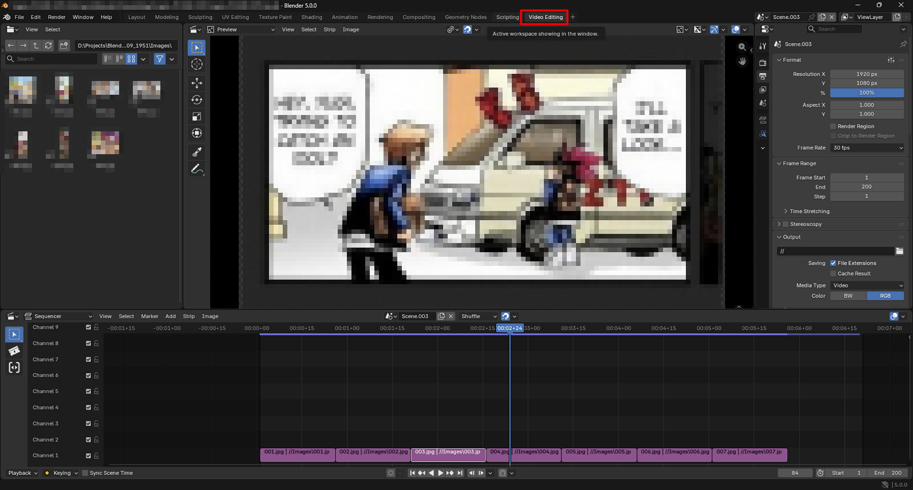
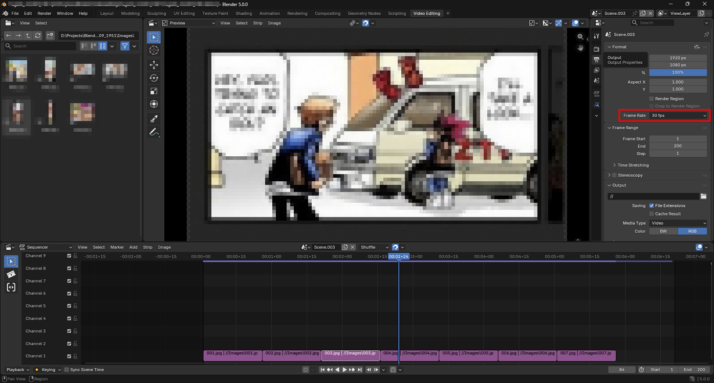
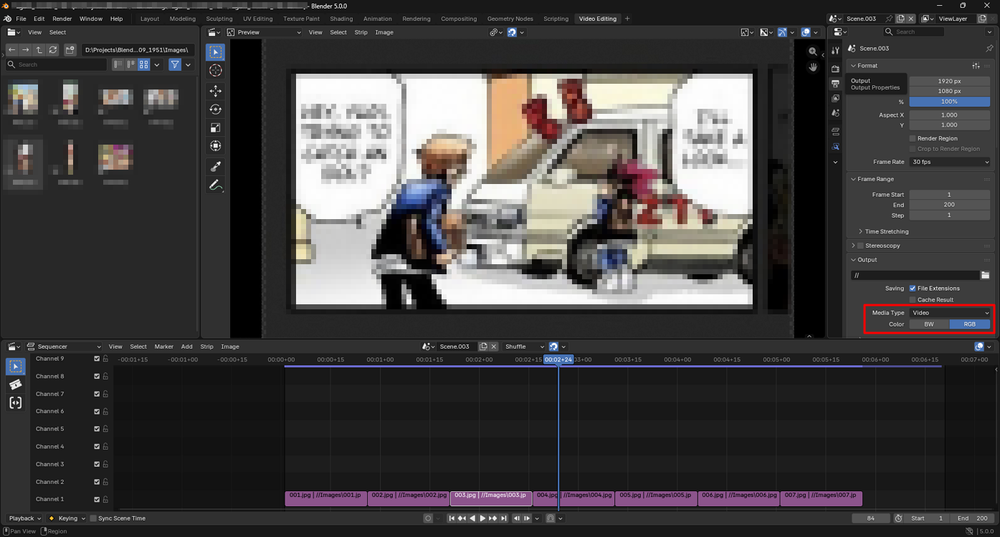
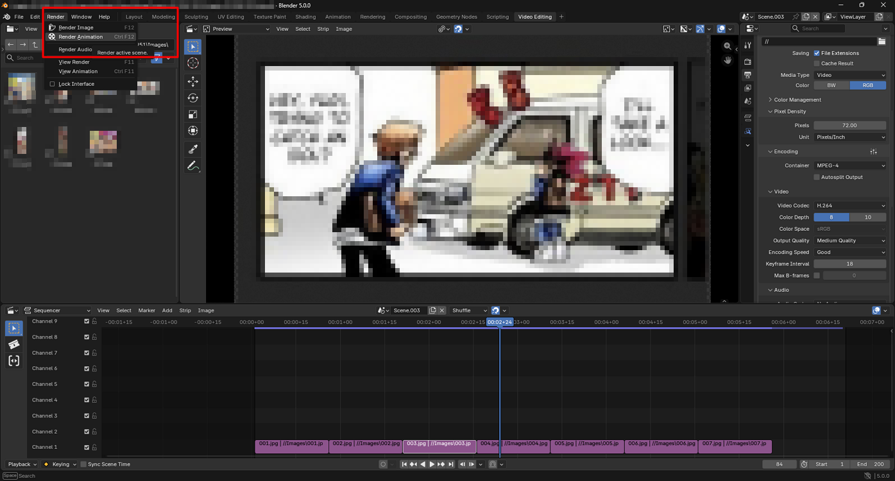
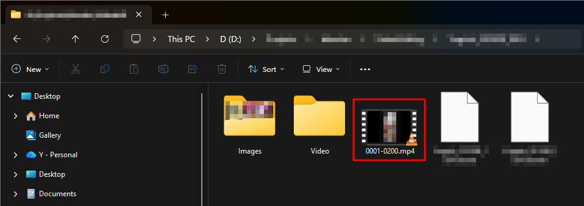

# Render a slideshow

1. Open **Video Editing**.
   

2. Select the scene.
   

    !!! Tip  
         Select the same scene in both the timeline and the Properties panel.

3. Open **Format**.
   

4. Select **1920 × 1080**.
   

    !!! Note  
         **1920 × 1080** means Full HD.

5. Select **30 fps** for the slideshow.
   

6. Set the frame range by selecting the start frame and end frame.
   

7. Select the output folder.
   

8. Select **Video**, then choose the color mode.
   

    !!! Note  
         **BW** means **black and white**.

9. Select **MPEG-4**.
   

10. Select **H.264**.
    

    !!! Note  
         **H.264** produces an **MP4 video**.

11. Select **Render Animation**.
    

12. The MP4 video is generated.
    
