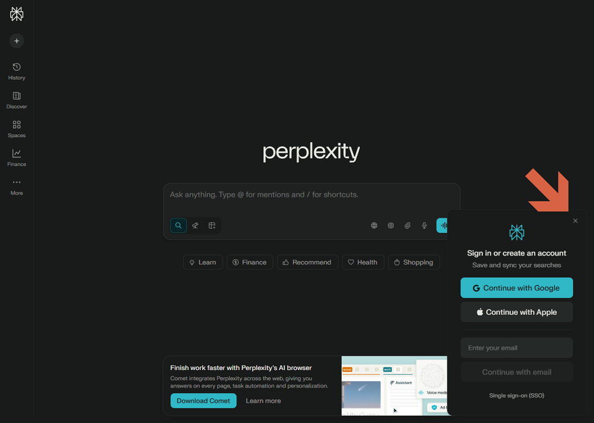

# Create a Perplexity account

1. Close the window.
   

2. Click **Sign In**.
   

3. Enter your email address.
   

4. Confirm your email address.
   

5. Enter the verification code.
   

6. The account is created.
   
