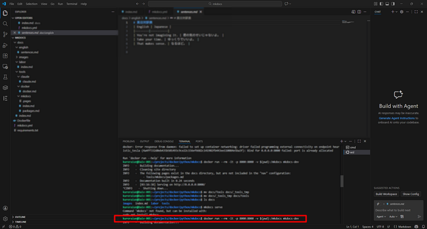
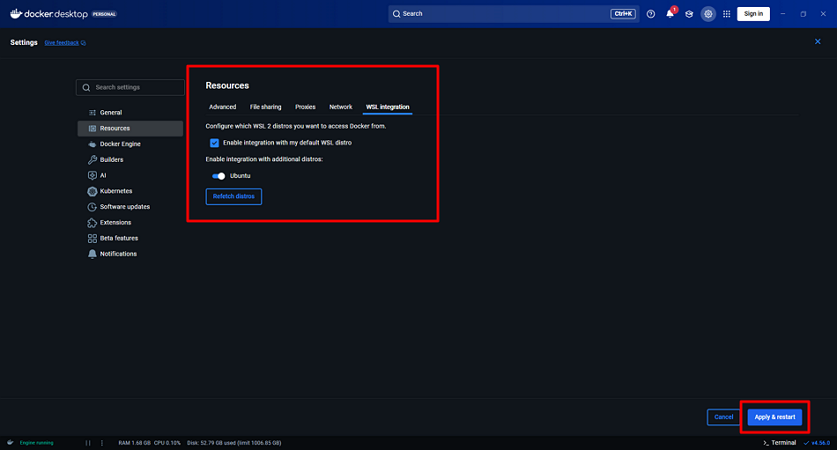

# Fix "failed to connect to the Docker API" in VS Code

## Environment
- **OS:** Windows 11
- **Subsystem:** WSL2 (Ubuntu)
- **Editor:** Visual Studio Code
- **VS Code Extension:** WSL
- **Docker:** Docker Desktop

## Symptoms

Running the following command in the Ubuntu terminal inside VS Code:

```bash title="terminal"
docker run --rm -it -p 8000:8000 -v $(pwd):/mkdocs mkdocs-dev
```

Results in:

```bash title="terminal"
failed to connect to the docker API at unix:///var/run/docker.sock; 
check if the path is correct and if the daemon is running: 
dial unix /var/run/docker.sock: connect: no such file or directory
```



## Cause
Docker Desktop is running, but WSL integration for the Ubuntu distro is disabled.  
As a result, the Docker socket (`/var/run/docker.sock`) is not available inside WSL.

## Solution

1. Open Docker Desktop.

1. Go to **Settings**.


1. Navigate to **Resource** > **WSL integration**.
	1. Enable:
		- **Enable integration with my default WSL distro.**
		- **Ubuntu** under **Enable integration with additional distros**.
	1. Click **Apply & restart**.


1. Restart VS Code.
