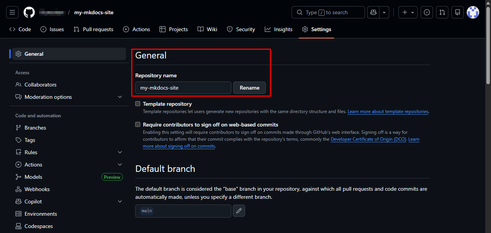

# Change a repository name

You can rename your repository at any time from the repository settings.

## Steps

1. Go to your repository on GitHub.
2. Click **Settings** in the top navigation bar.
3. Make sure the **General** tab is selected.
4. Under **Repository name**, enter the new name for your repository.
5. Click **Rename** to apply the change.


## Notes

* GitHub will automatically redirect old repository URLs to the new name.
* However, you should update any local clones to avoid relying on redirects.

To update your local repository remote URL, run:

```bash
git remote set-url origin https://github.com/USERNAME/NEW-REPOSITORY-NAME.git
```

