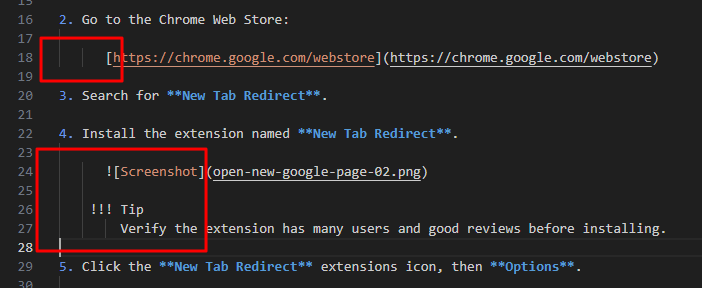

# Add indentation in instruction steps

Indent nested content correctly inside numbered steps.

## Steps

1. Write the numbered step.

2. Indent nested content so it belongs to the step.

3. Insert the content under the step.

   ```
    
   ```

## Indentation rules

Use consistent indentation markers when documenting structure.

### Screenshots

```text
[tab][tab]
```

### URLs

```text
[tab][tab]https://example.com
```

### Code blocks

````text
[tab]```bash
[tab]command
[tab]```
````

### Admonitions

```text
[tab][space]!!! note
[tab][tab][space]Content
```

### Additional text

```text
[tab][space][space]Additional explanation text
```

## Note

Incorrect indentation causes content to render outside the numbered list.
Always verify list structure after adding code blocks, images, URLs, or admonitions.
