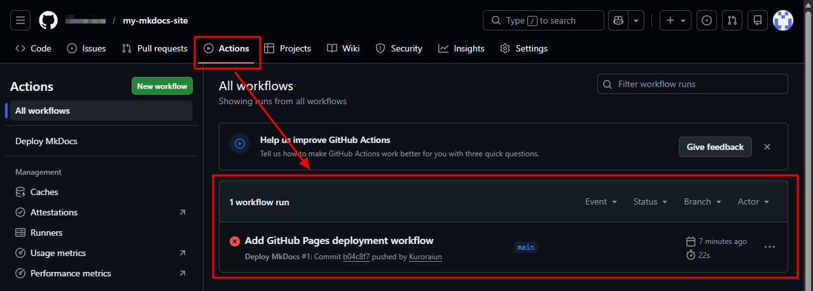
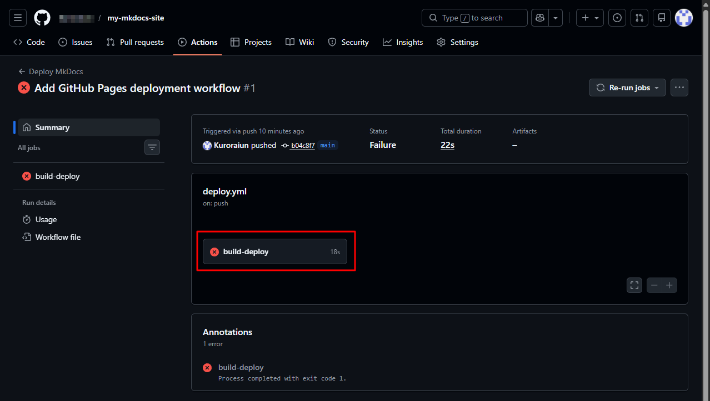

# View deployment errors

You can view deployment errors from the Actions tab in your repository.

## Steps

1. Go to your repository on GitHub.

2. Click the **Actions** tab, then select the workflow run that shows a failed status (❌).

    

3. In the workflow details, click **build-deploy**.

    

4. Review the logs to identify the error.

    

## Tip

* Expand individual steps to see detailed error messages.
* The error message is usually shown in the step marked with a ❌ icon.
