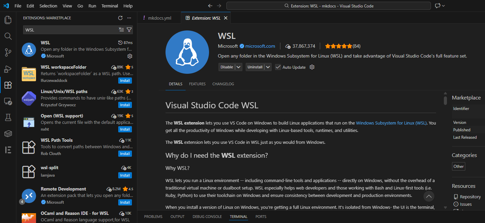

# Add an image to a folder

## Environment
- **OS:** Windows 11
- **Subsystem:** WSL2 (Ubuntu)
- **Editor:** Visual Studio Code
- **VS Code Extension:** WSL

## Step 1: Install the **WSL** extension in VS Code

1. Press **Ctrl + Shift + X** to open the **Extensions** view, then search for **“WSL” by Microsoft**.

    

2. Install the extension.

    

3. Restart VS Code after installation.

## Step 2: Connect to WSL

1. Press **Ctrl + Shift + P**.

2. Select **Connect to WSL**.

    

3. Check the following two indicators:

    

    * **Title bar:** `mkdocs [WSL: Ubuntu]`
    * **Bottom-left:** `WSL: Ubuntu`

    This means VS Code is running **inside WSL**.

## Step 3: Check if the **code** command is available

1. Open a new Ubuntu terminal.

2. Run:

    ```bash
    code --version
    ```

3. You should see a version number, for example:

    ```
    1.86.2
    ```

## Step 4: Add the image to the folder

1. To open the folder, run:

    ```bash
    code ~/projects/docker/python/mkdocs
    ```

2. Open the file where you want to add the image.

3. Drag the image from Windows Explorer into the editor.

4. Hold **Shift** to select the drop location, then release the image.
