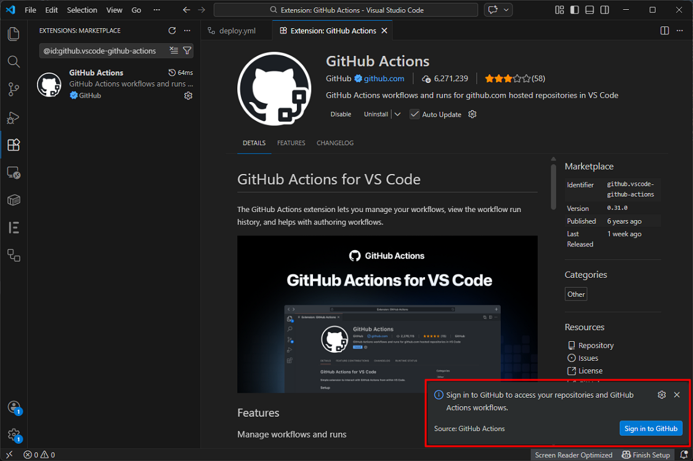
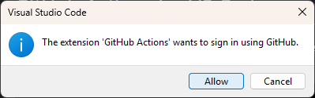
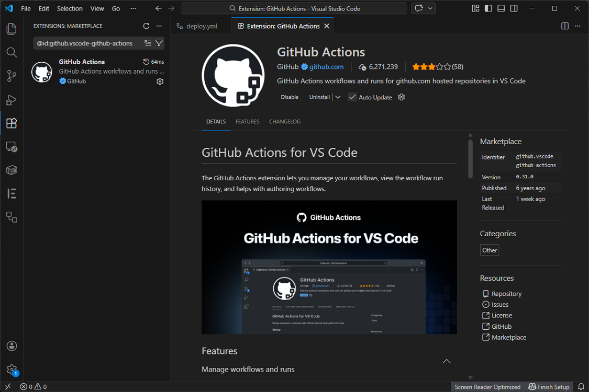

# Install the GitHub Actions extension

1. Click **Install**.

    

1. Click **Sign in to GitHub**.

    

1. Click **Allow**.

    

1. Click **Continue**.

    

1. Click **Open Visual Studio Code**.

    

1. The installation is complete.

    