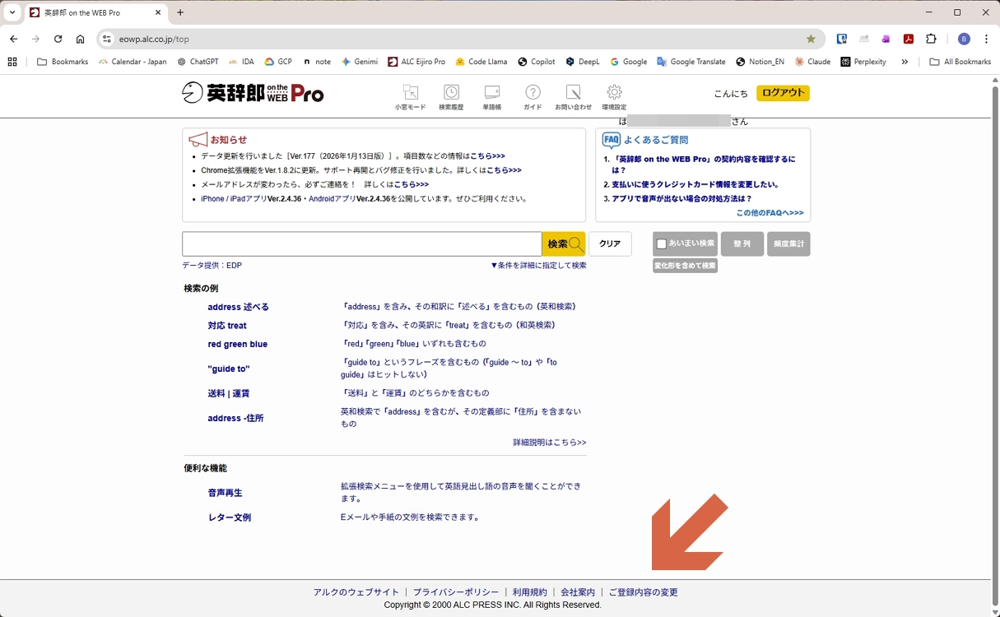

# Delete account

Delete your account from **Eijiro on the WEB**.

## Steps

1. Open the top page and click **Change registered info**.

    

2. Click **Delete account**.

    

3. Follow the on-screen instructions to complete the deletion.
