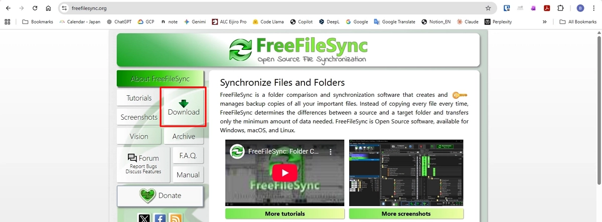
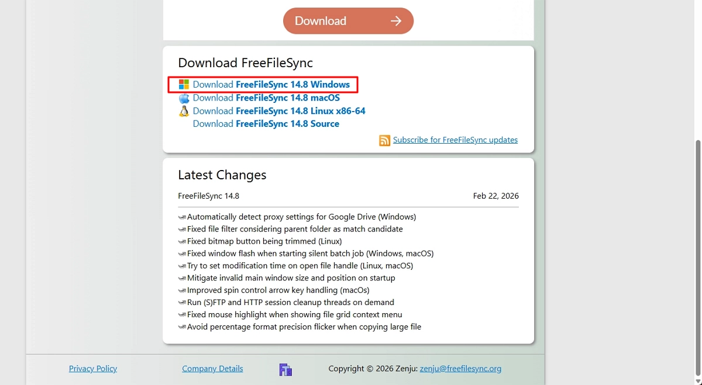
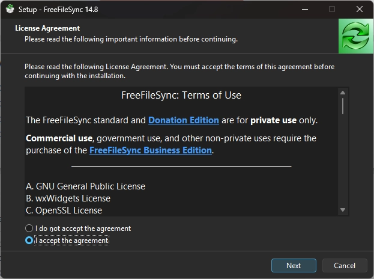
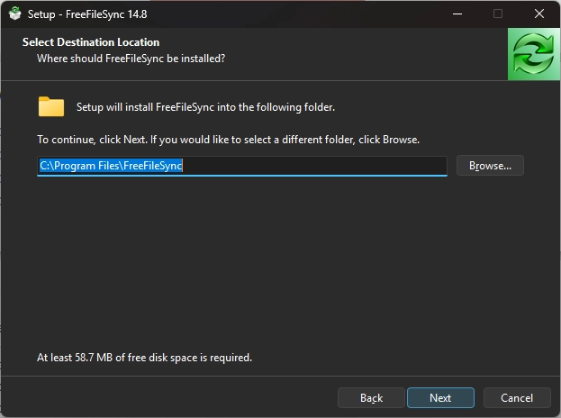
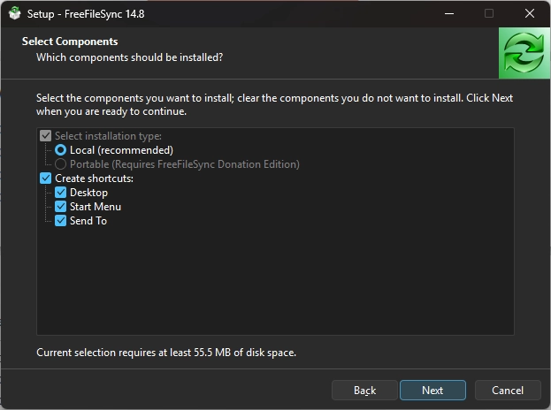

# Install FreeFileSync

Install FreeFileSync from the official website.

## Steps

1. Open the official website.

    https://freefilesync.org

2. Click **Download**.

    

3. Scroll down the page.

    

4. Click **Download FreeFileSync Windows**.

    

5. Select **I accept the agreement**, then click **Next**.

    

6. Select the installation location, then click **Next**.

    

7. Select the components to install, then click **Next**.

    

8. Click **Finish**.

    
