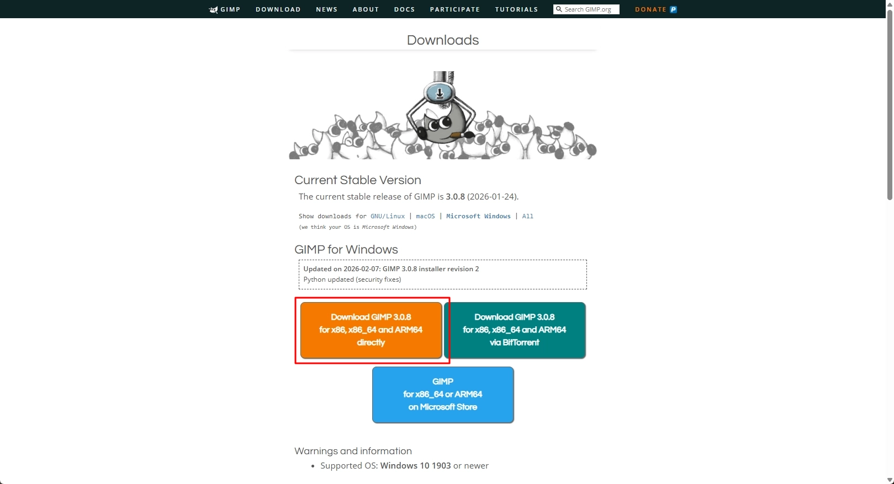
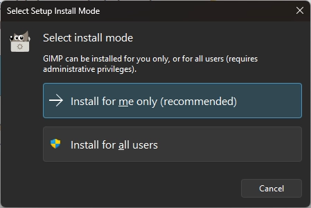

# Install GIMP on Windows

Download and install GIMP using the official installer.

## Steps

1. Go to the official GIMP download page:
   [https://www.gimp.org/downloads/](https://www.gimp.org/downloads/)

2. Click **Download GIMP 3.x.x directly** under **GIMP for Windows**.
   Do not select **GIMP on Microsoft Store**.

    

3. Double-click the downloaded installer file.

4. In **Select install mode**, click **Install for me only (recommended)**.

    

5. Follow the setup wizard instructions.

6. Click **Finish** to complete the installation.

    

## Note

Supported OS: **Windows 10 1903** or later.
