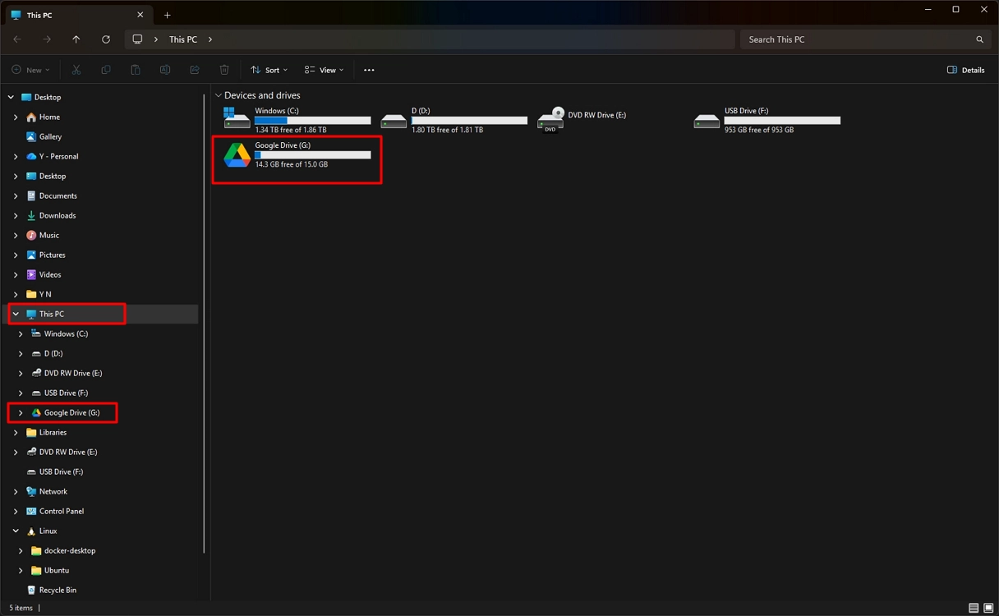

# Open the Google Drive folder in Windows

Access the Google Drive folder from **This PC** in File Explorer.

## Steps

1. Open **This PC** in File Explorer.

2. If **Google Drive** is not visible in the folder tree, close **This PC**, then open it again.

3. Locate **Google Drive** under **This PC** in the folder tree.
    
4. The **Google Drive** drive is also usually shown under **Devices and drives**.

    
