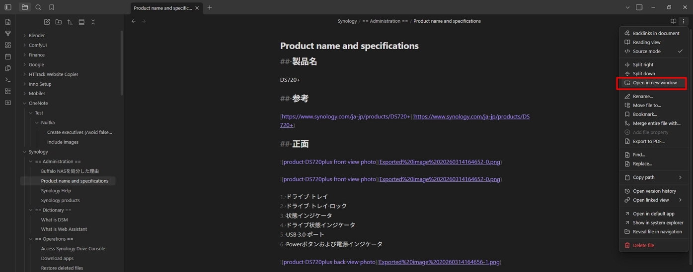

# Display linked images

Display linked images in Obsidian while editing Markdown files.

## Open a Live Preview window

1. Click the **three dots (⋯)** in the top-right corner of the editor.

2. Select **Open in new window**.

    

## Enable Live Preview

1. Open **Settings**.

2. Select **Editor**.

3. Enable **Live Preview**.

## Switch to Reading view

Press:

```
Ctrl + E
```
