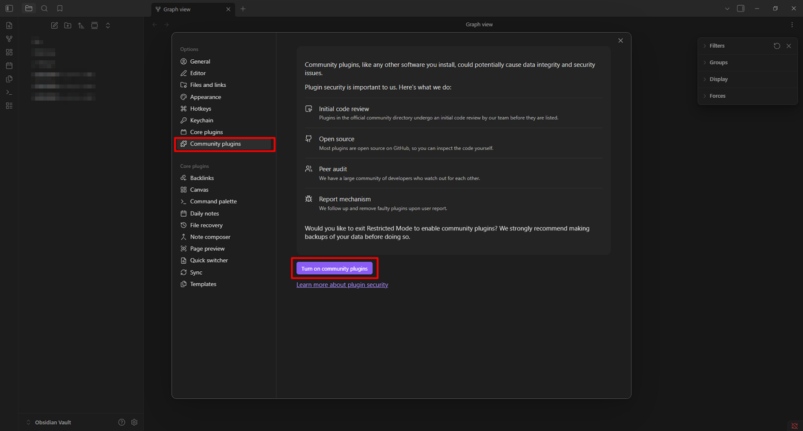
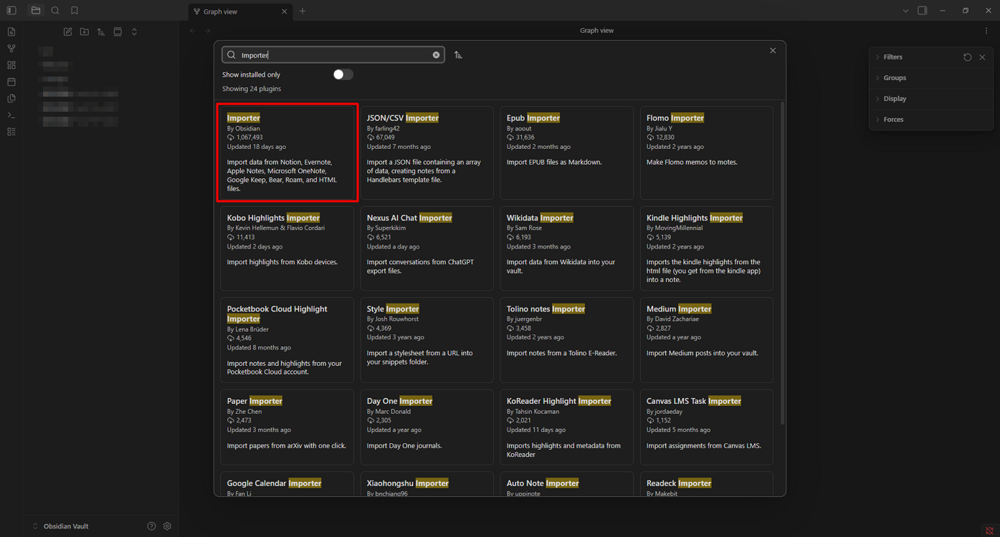
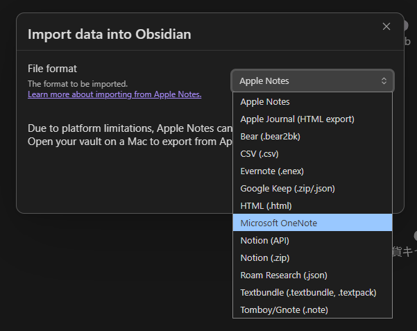
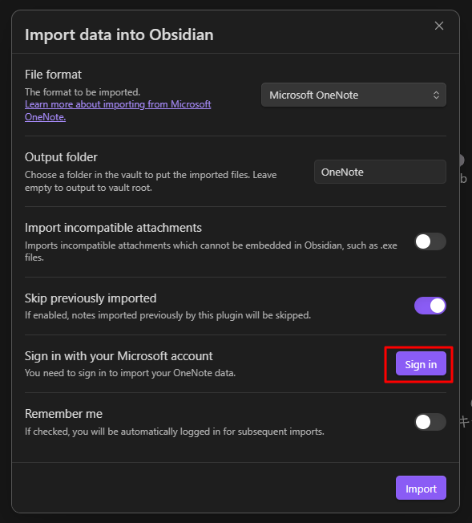
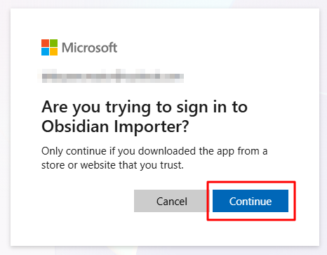
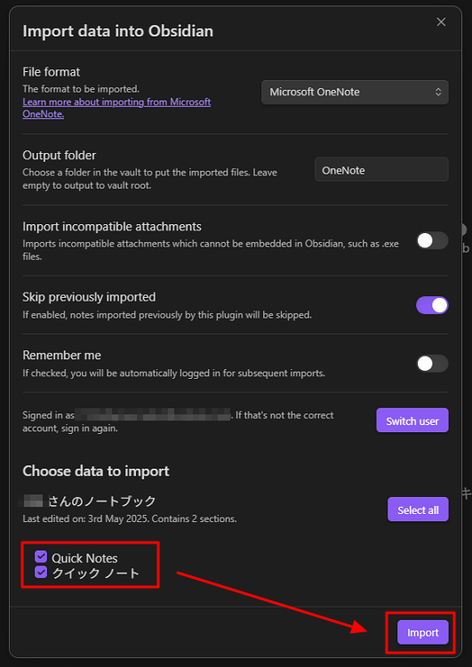

# Import OneNote pages into Obsidian

Use Obsidian’s **Importer** plugin to pull your notes straight from **Microsoft OneNote** into your Obsidian vault in Markdown format.

Official reference: [https://help.obsidian.md/plugins/importer](https://help.obsidian.md/plugins/importer)

## Steps

1. Open **Settings**.

    

2. Open **Community plugins**, then disable **Restricted mode**.

    

3. Click **Browse**.

    

4. Search for **Importer**.

    

5. Click **Install**.

    

6. Click **Enable**.

    

7. Click **Open Importer**.

    

8. Select **Microsoft OneNote**.

    

9. Sign in with your Microsoft account.

    

10. Click **Continue**.

    

11. Select notebooks to import, then click **Import**.

    
 
12. The plugin converts pages to Markdown and saves attachments in your vault.

    

## Notes

* Only notebooks synced to OneDrive are supported.
* Large notebooks may take time to process.
* Complex layouts, ink drawings, and embedded files may not convert perfectly.
* Review imported notes and adjust formatting if necessary.
