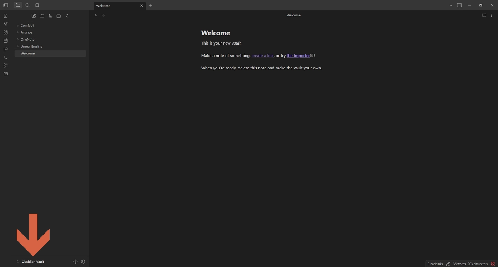
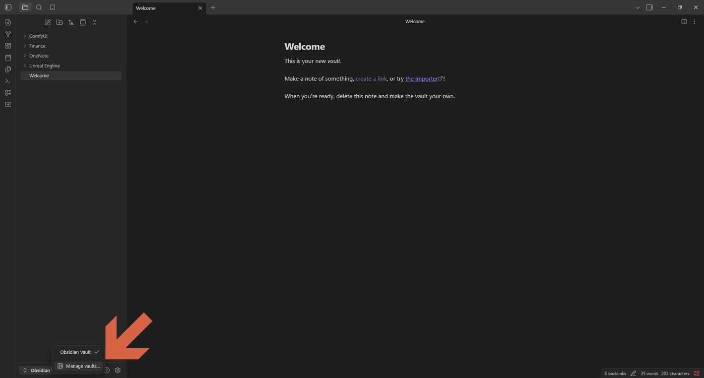
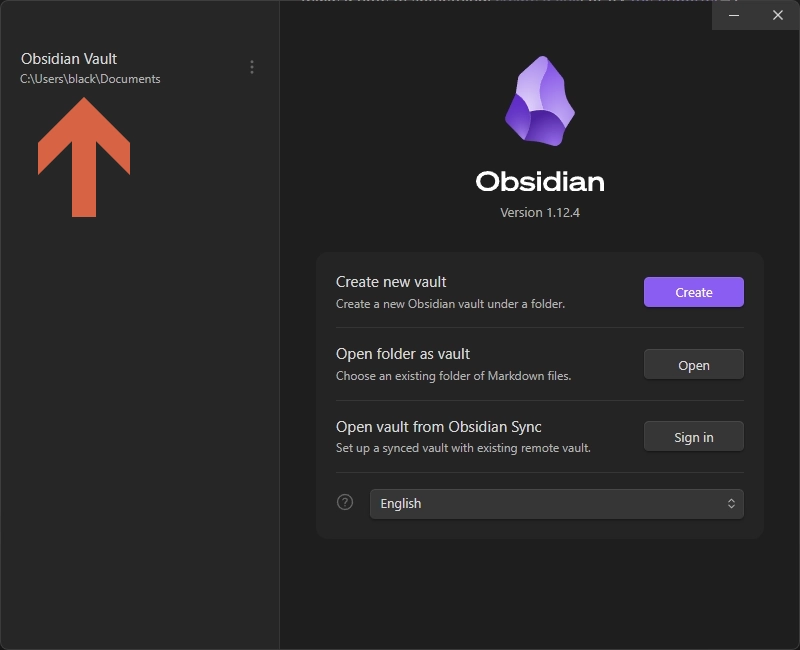
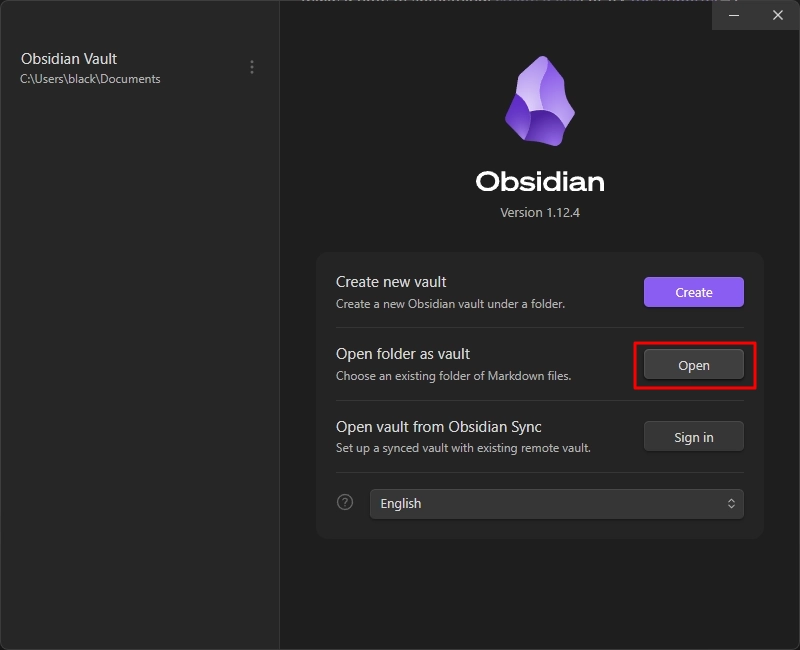
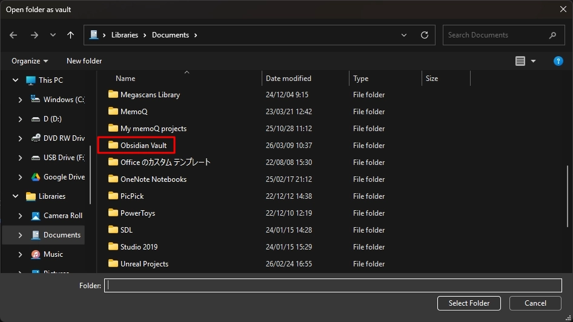

# Open the vault folder

Open the folder where the Obsidian vault is stored.

## Steps

1. Click **Obsidian Vault** in the lower-left corner.

    

2. Click **Manage vaults**.

    

3. Locate the vault path shown at the top.

    

4. Click **Open** under **Open folder as vault**.

    

5. Select the folder named **Obsidian Vault**.

    