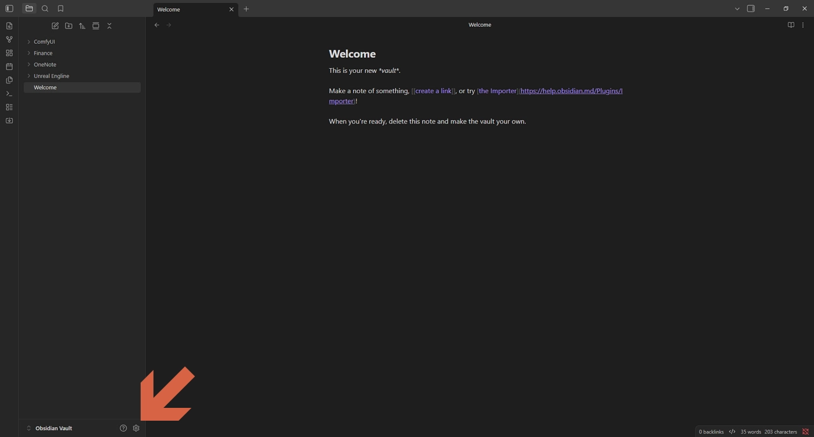
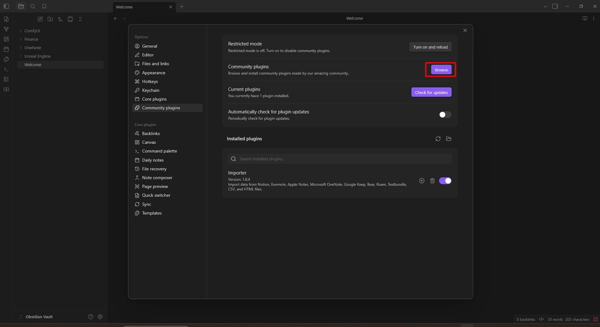
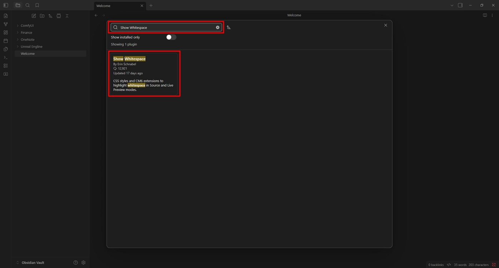
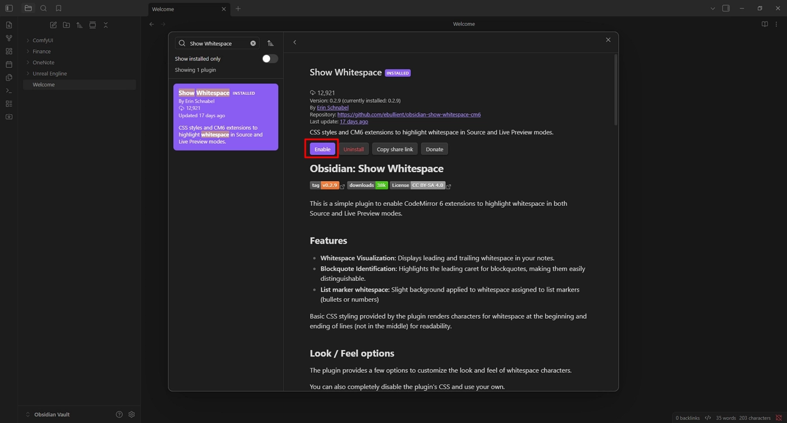

# Show whitespace

Display whitespace characters in Obsidian using the **Show Whitespace** plugin.

## Steps

1. Open **Settings**.

    

2. Click **Browse**.

    

3. Search for **Show Whitespace**.

    

4. Click **Install**.

    

5. Click **Enable**.

    