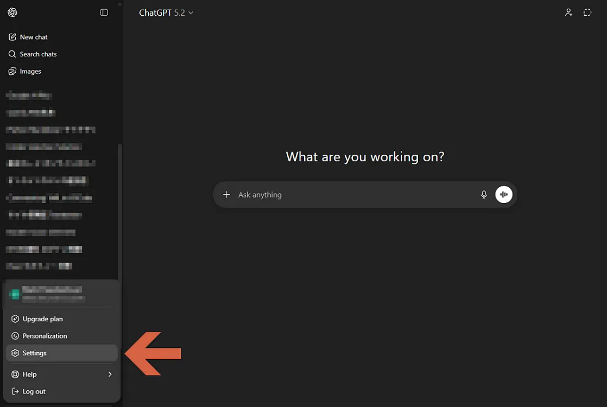
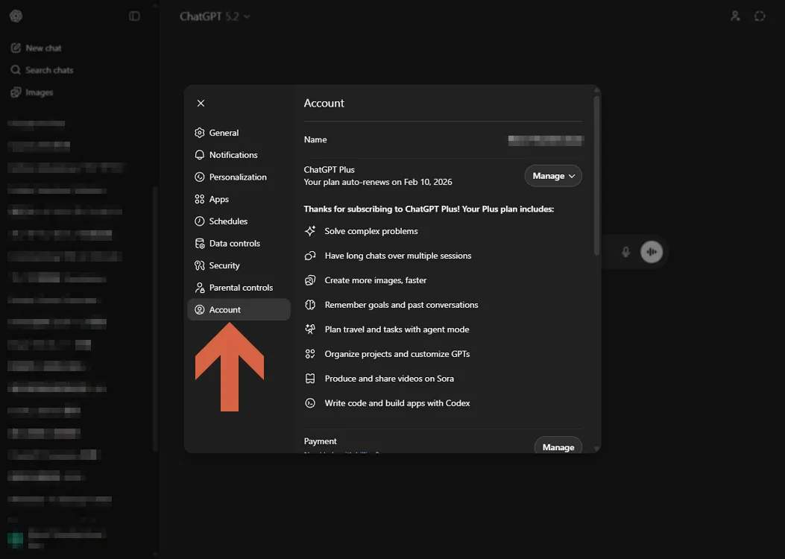
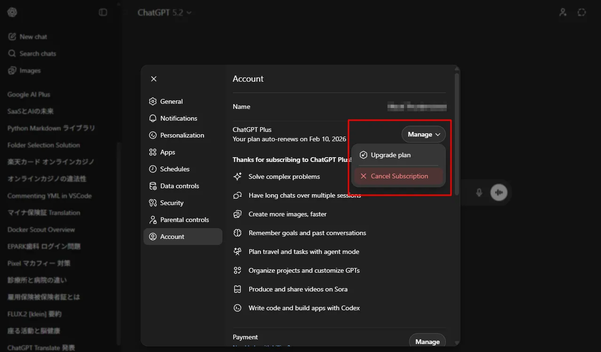
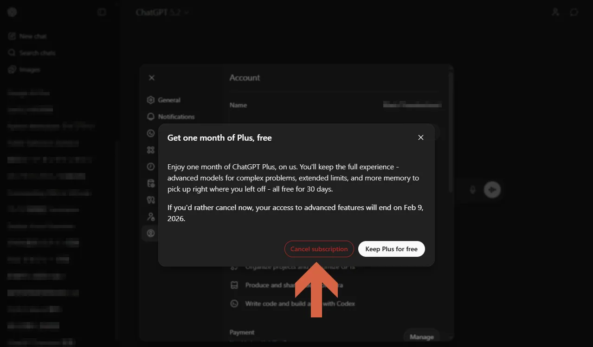
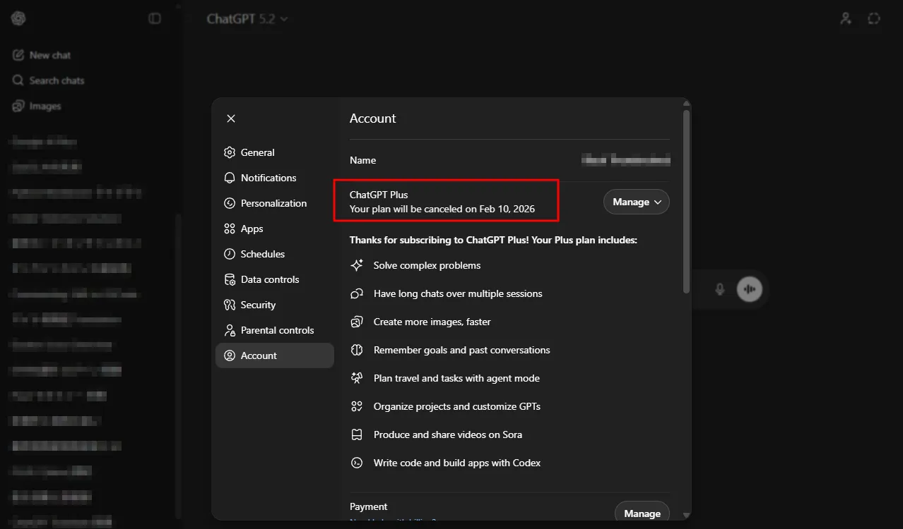

# Cancel a ChatGPT subscription

1. Select **Settings**.
    

1. Select **Account**.
    

1. Select **Manage** → **Cancel Subscription**.
    

1. Click **Cancel subscription**.
    

1. Confirm the expiration date.
    