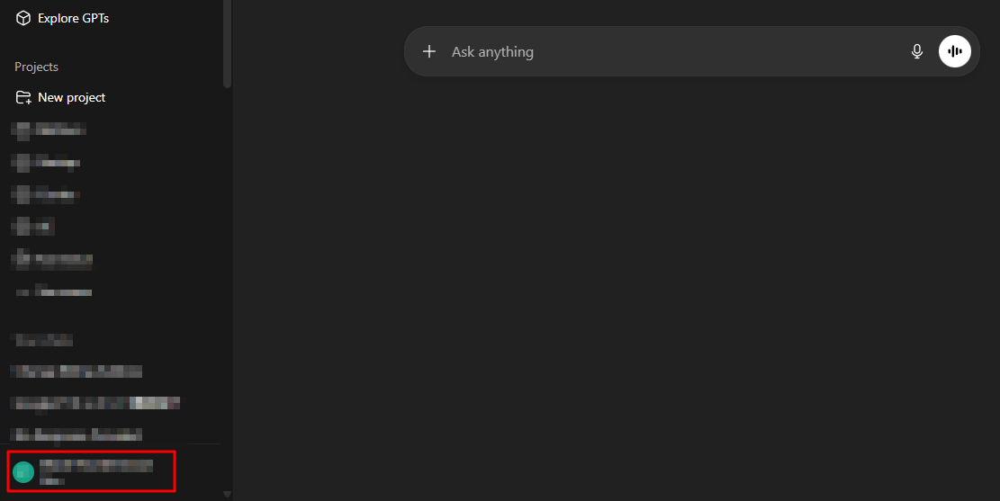
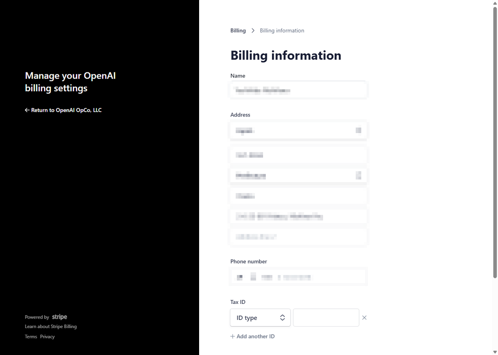

# Update a ChatGPT billing address

1. Click the profile icon.
   

2. Select **Settings**.
   

3. Select **Account**.
   

4. Click **Manage** under **Payment**.
   

5. Click **Update information**.
   

6. Update the billing information.
   
