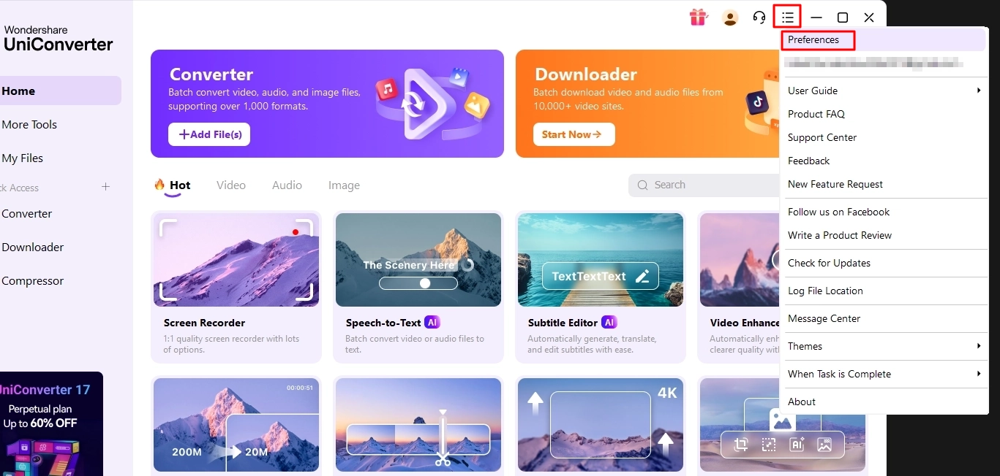
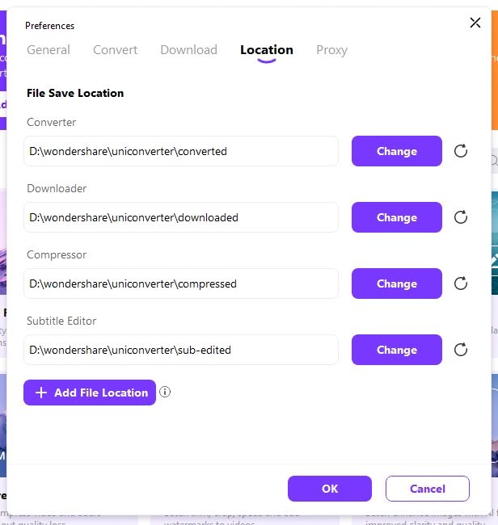

# Change save folders

Change the default folders used to save converted and downloaded files.

## Steps

1. Click the **hamburger menu**, then select **Preferences**.

    

2. Open the **Location** tab.

3. Click **Change** for the folder you want to modify.

4. Select the new folder, then click **OK**.

    
