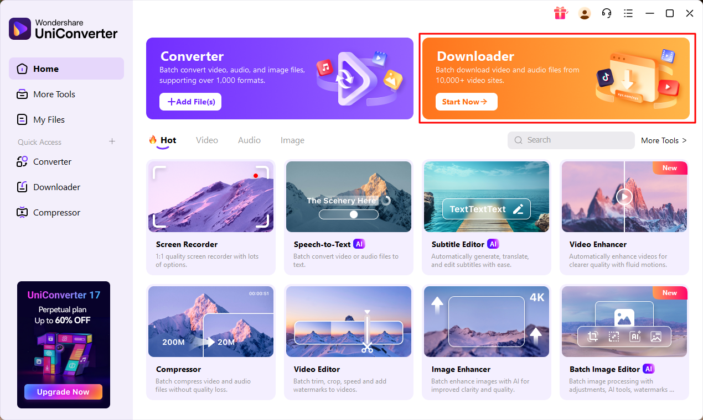
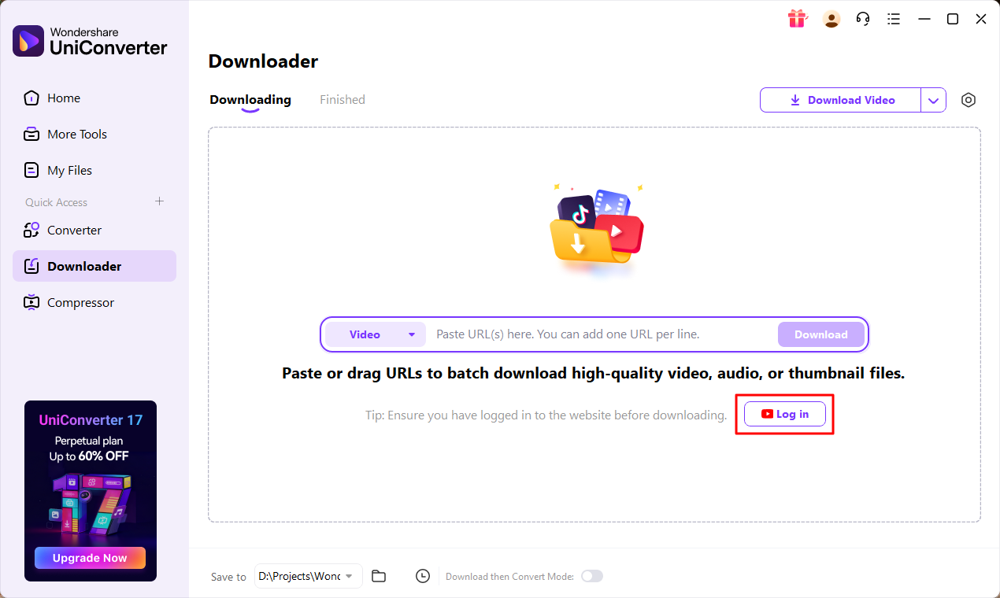
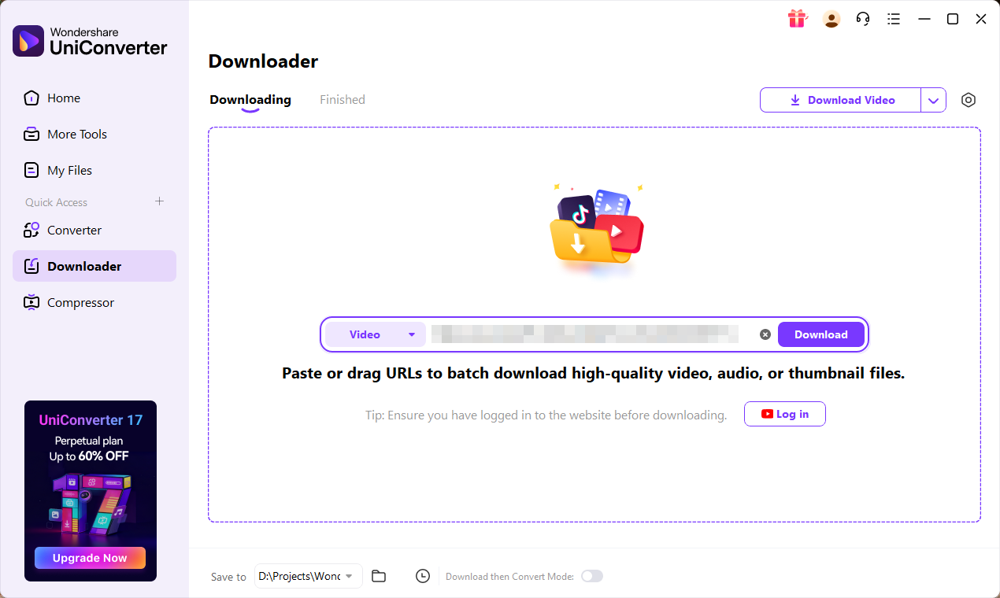
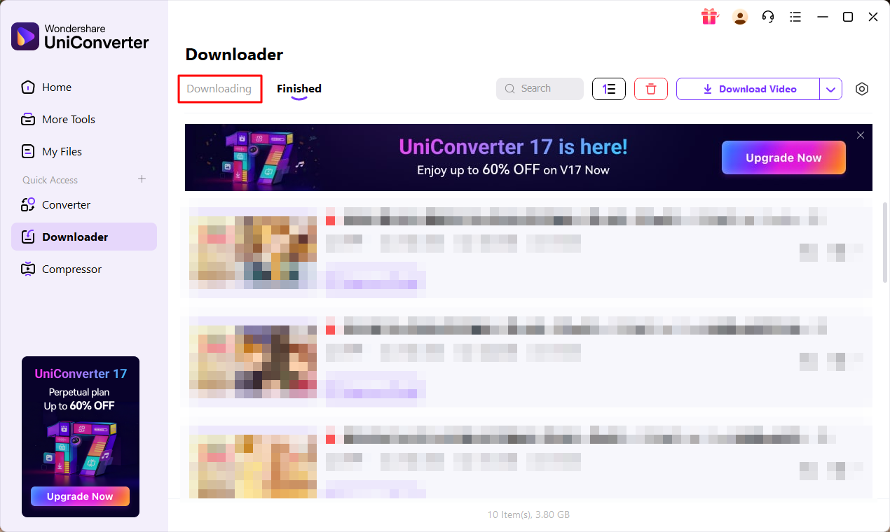

# Download a YouTube video

1. Click **Start Now**.
   

2. Log in to YouTube.
   

3. **Paste** the video URL, then click **Download**.
   

4. To download another video, click **Downloading** to return to the previous screen.
   

