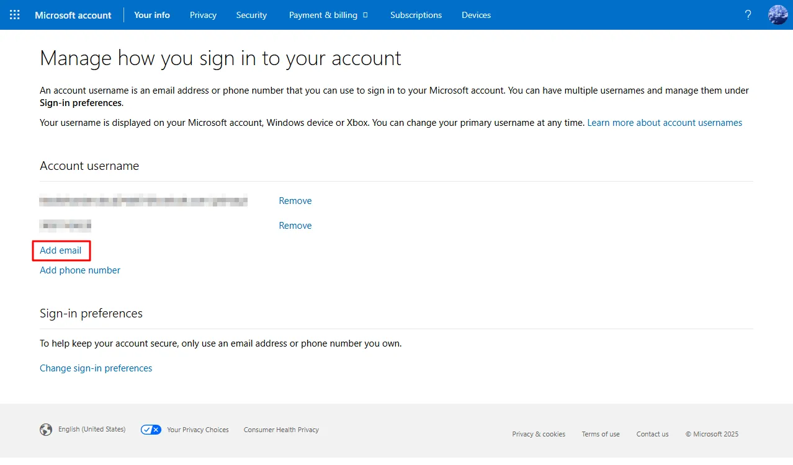
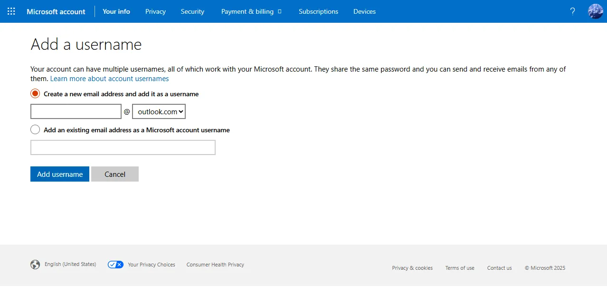
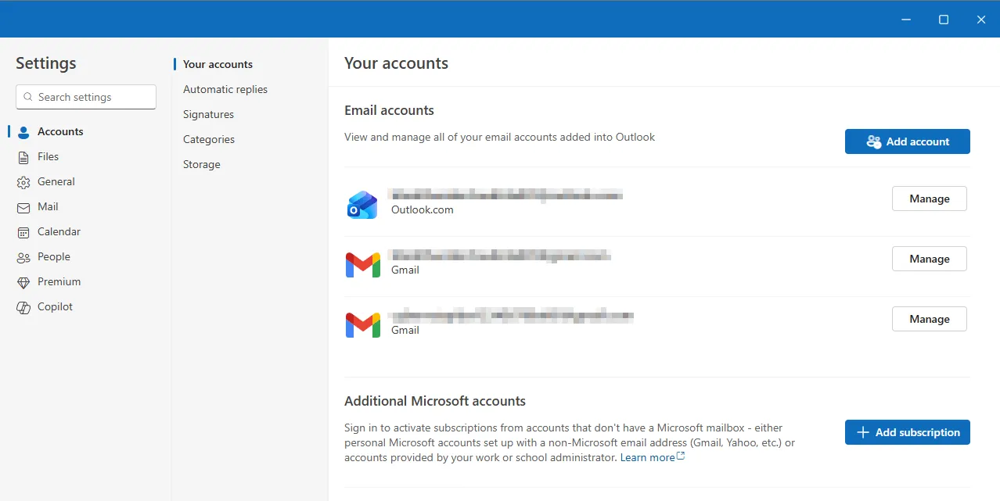
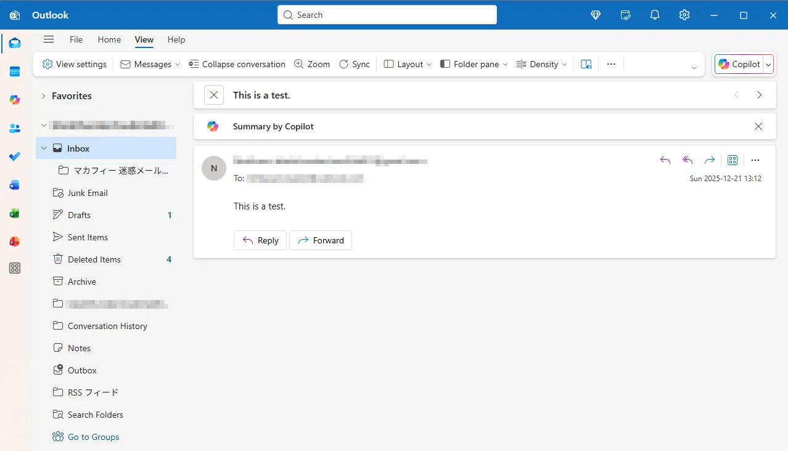
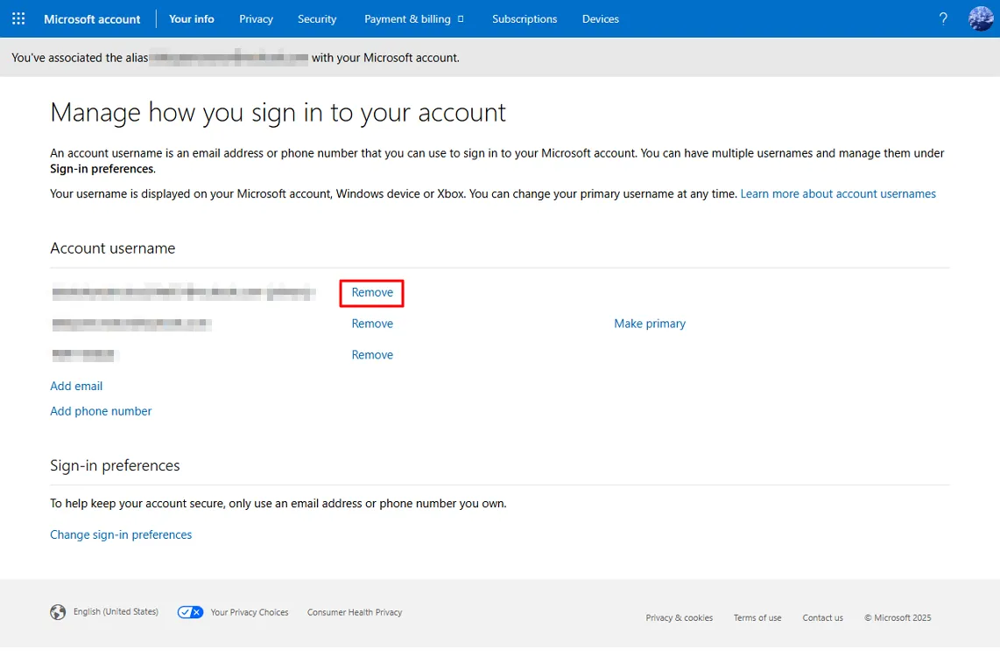

# Change the email address

1. Click **Add email**.
   

2. Create a new email address.
   

3. Add the new email address to Outlook.
   

4. Test the new email address.
   

5. Remove the old email address.
   
