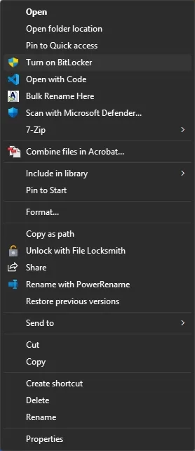
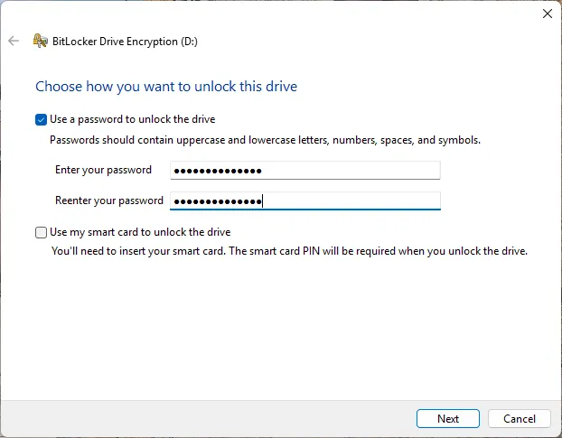
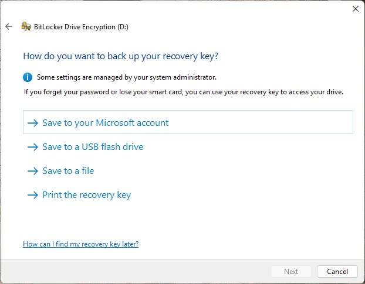
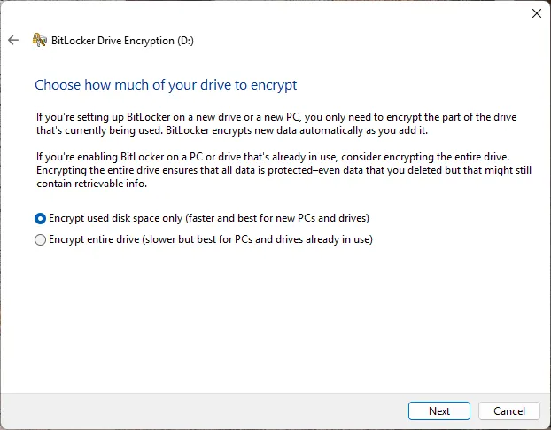
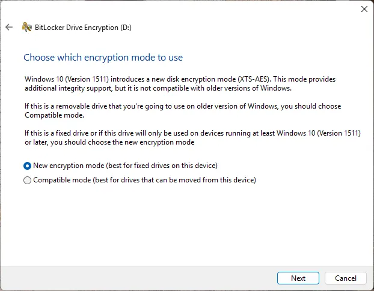
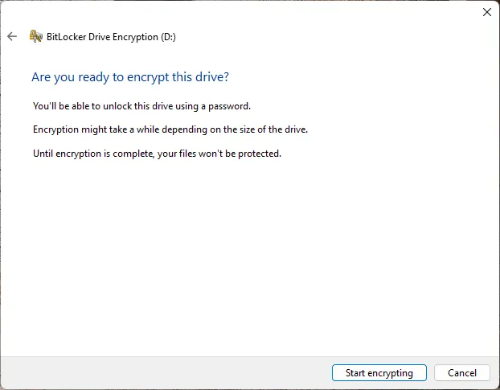
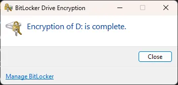

# Lock a drive using BitLocker

Encrypt a drive with BitLocker to protect the data.

## Steps

1. Right-click the drive (for example **D:**), then select **Turn on BitLocker**.

    

2. Enter a password to unlock the drive.

    

3. Select **Save to your Microsoft account** to store the recovery key.

    

4. Select **Encrypt used disk space only**.

    

5. Select **New encryption mode**.

    

6. Click **Start encrypting**.

    

7. Click **Close** after the encryption is complete.

    

## Note

BitLocker is available on supported editions of Windows such as **Windows Pro** and **Windows Enterprise**.
