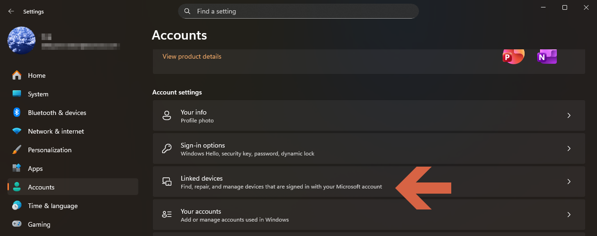
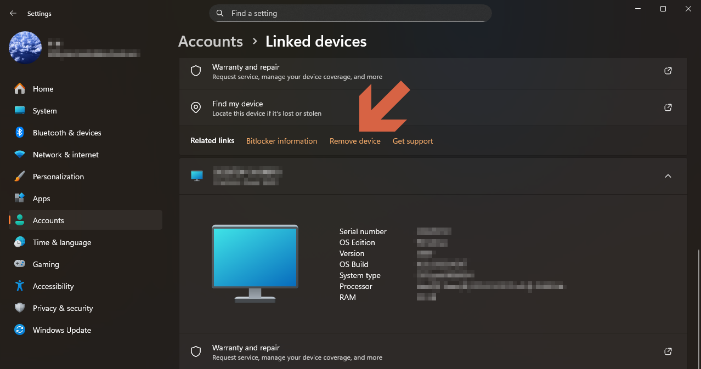
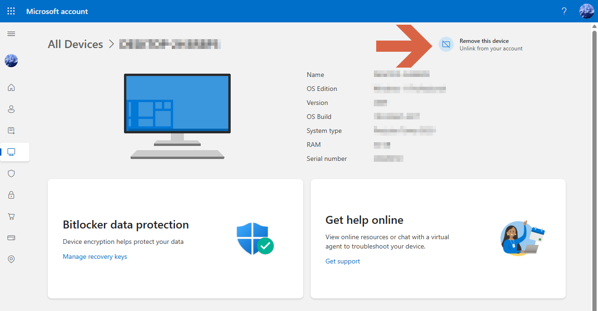
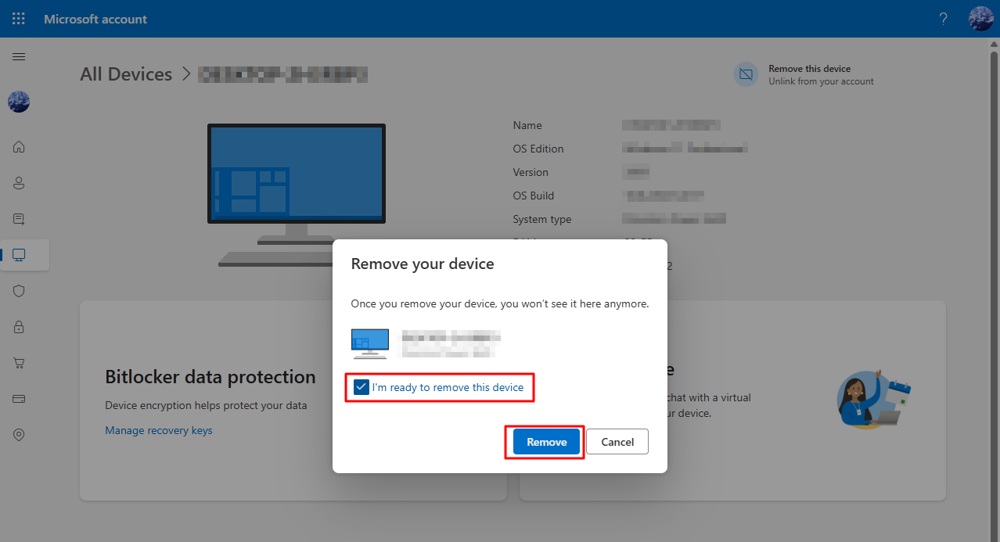
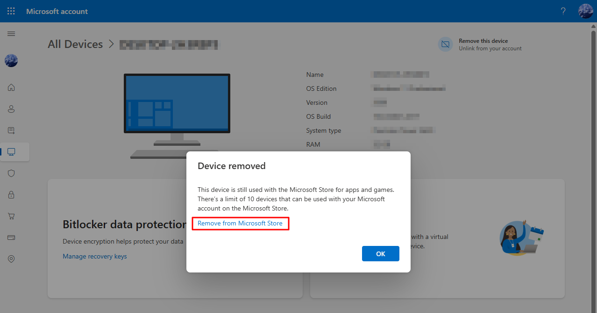
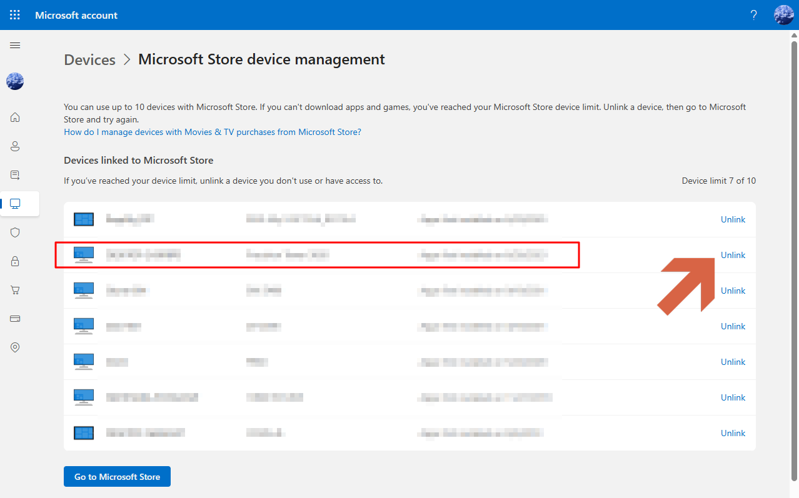
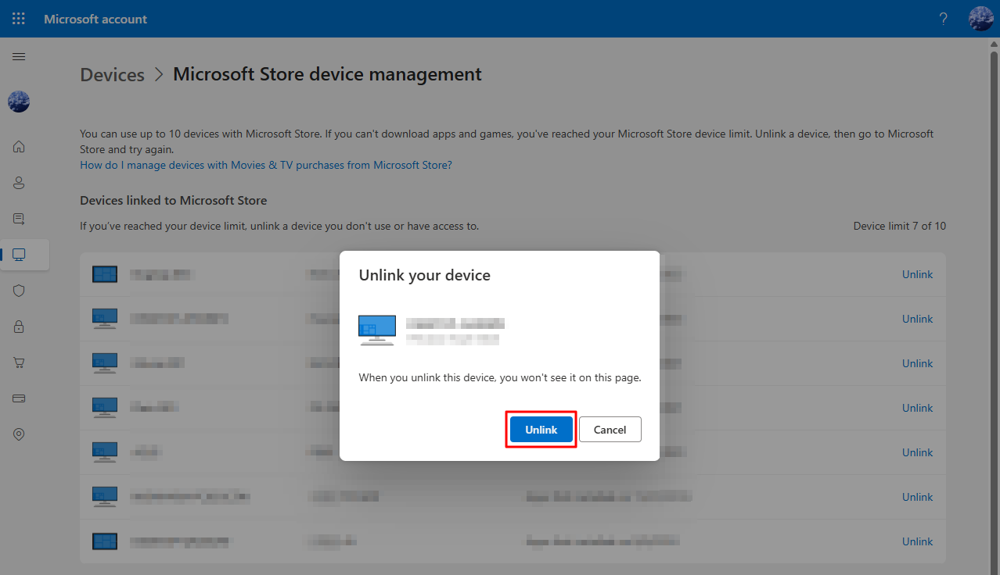
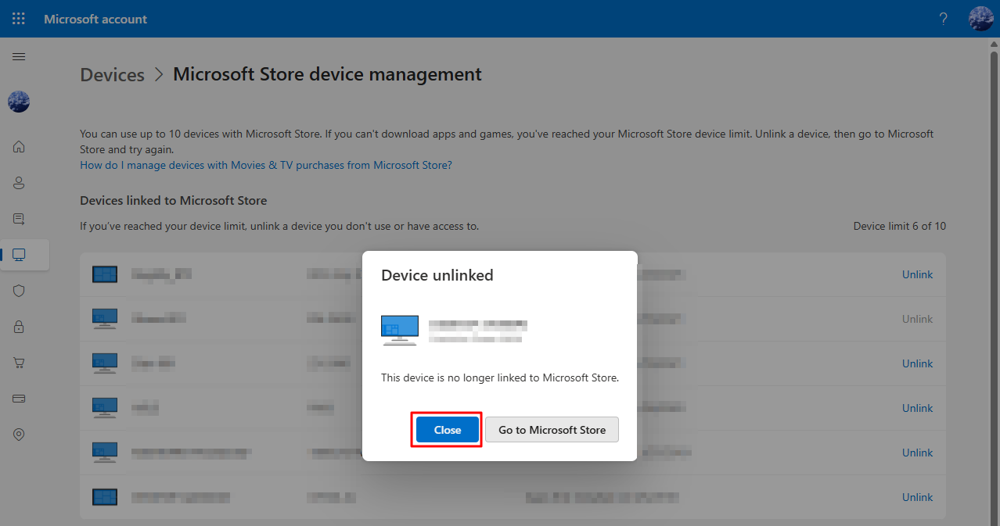

# Remove a PC from the Microsoft account
1. Click **Linked devices**.

1. Click **Remove device**. 

1. Click **Remove this device**.

1. Select **I'm ready to remove this device**, then click **Remove**.

1. Click **Remove from Microsoft Store**.

1. Click **Unlink**.

1. Click **Unlink**.

1. Click **Close**.
