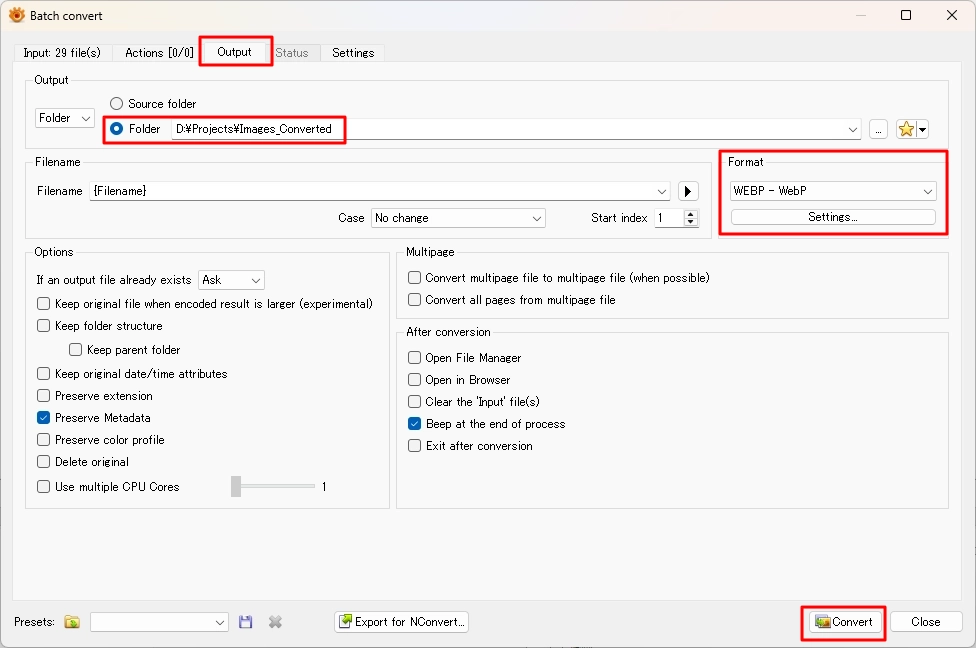

# Convert PNG to WEBP

Convert multiple PNG files to WEBP using XnView MP batch conversion.

## Steps

1. Select **Tools**, then click **Batch convert**.

    

2. In the **Input** tab, click **Add folder**, then select the folder containing PNG files.

    

3. Open the **Output** tab.

4. Under **Folder**, select the destination folder.

5. Under **Format**, select **WEBP - WebP**.

6. Click **Convert**.

    

## Note

Original PNG files remain unchanged unless **Delete original** is enabled in the output options.
