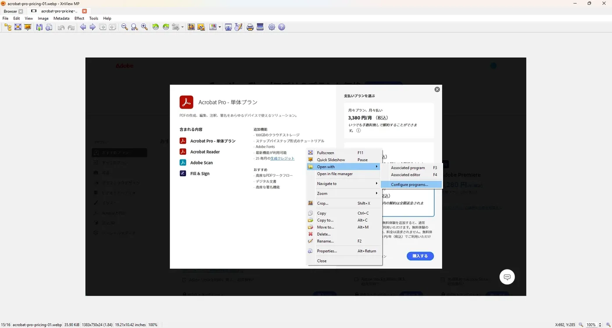
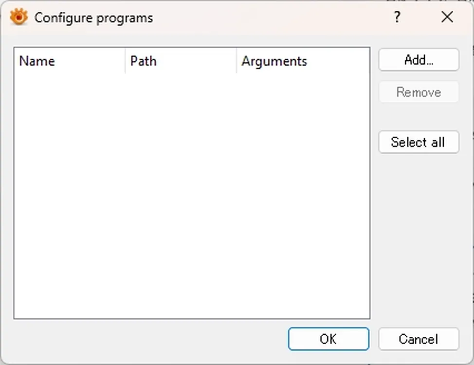
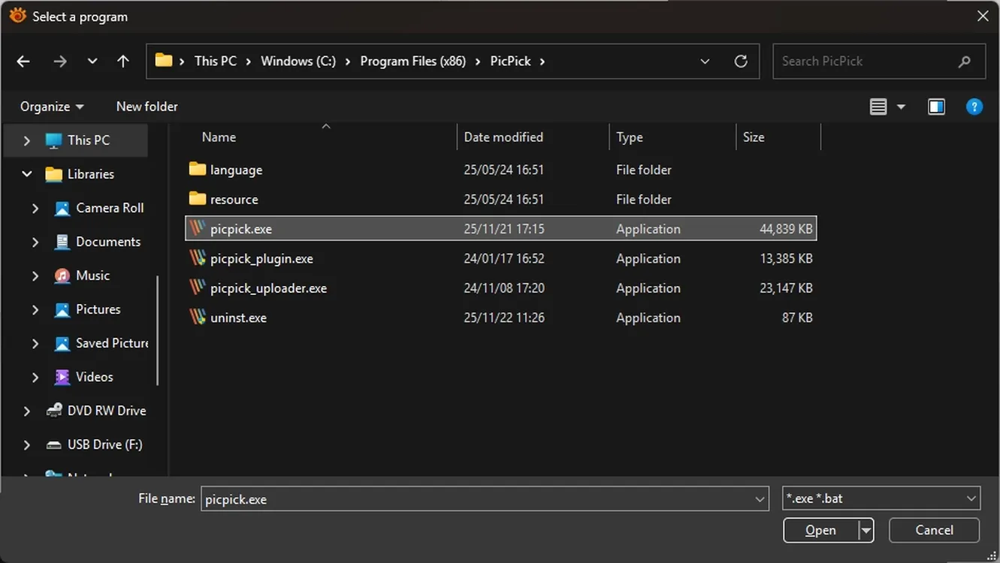
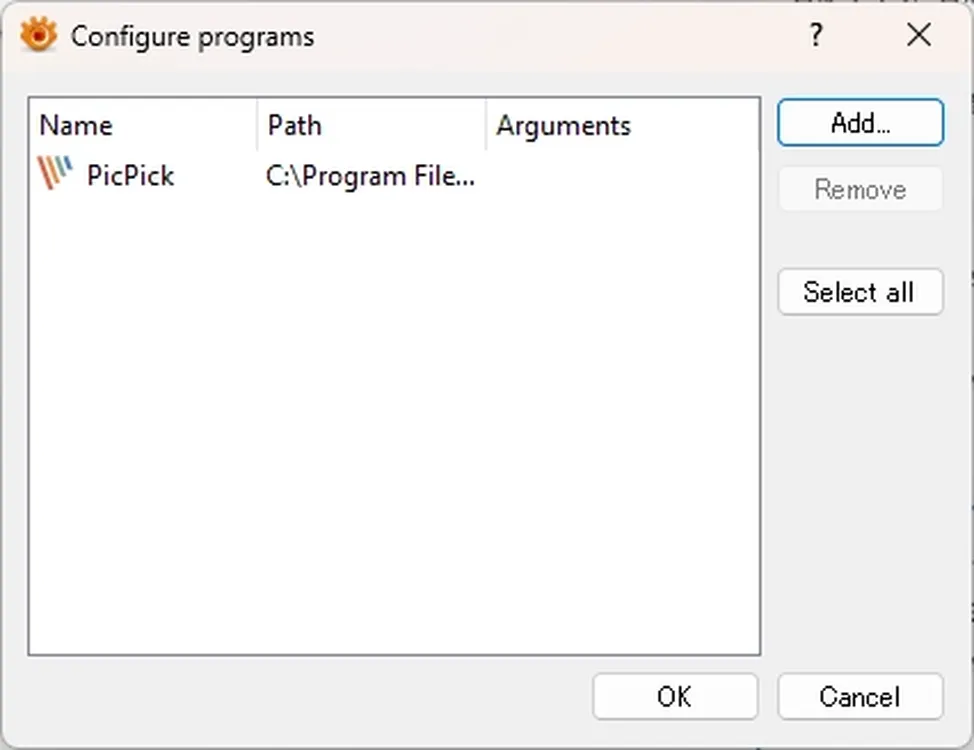

# Edit an image with an external editor

Configure an external image editor in XnView MP.

## Steps

1. Right-click the image, then select **Open with → Configure programs**.

    

2. Click **Add**.

    

3. Select the **.exe** file of the image editor.

    

4. Click **OK**.

    

5. Right-click the image, then select **Open with**, and choose the editor.