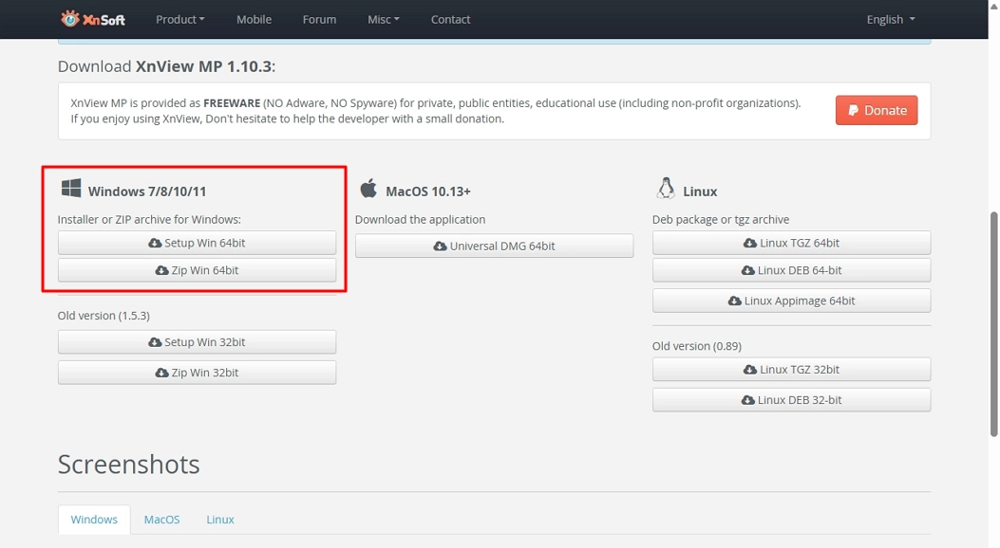

# Update XnView MP

Update XnView MP by installing the latest version. The installer overwrites the existing installation.

## Steps

1. Download the latest installer from the official website.

    

2. Run the installer and follow the setup wizard.

## Note

You do not need to uninstall the previous version before updating.
