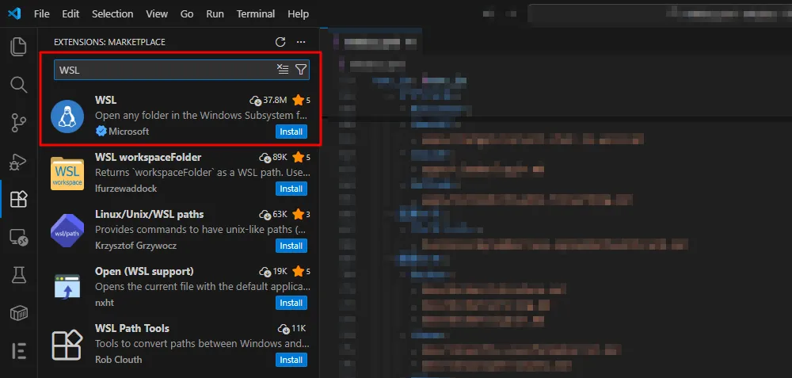
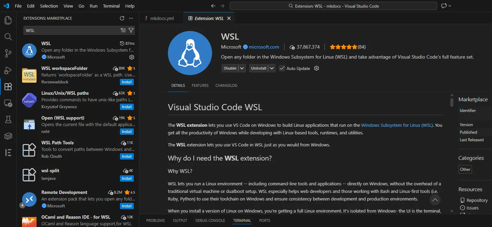
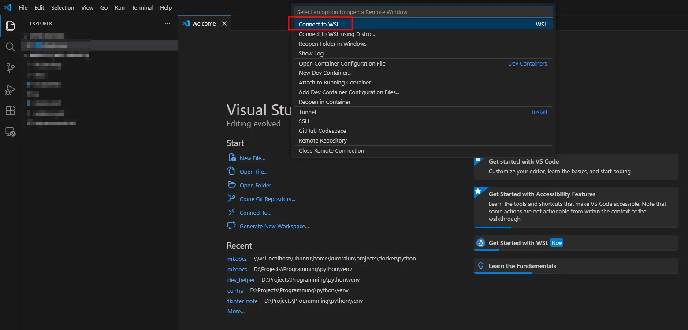
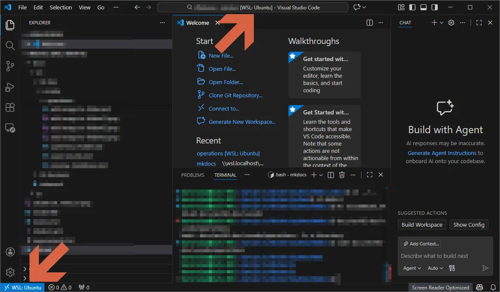

# Connect to WSL

Connect Visual Studio Code to the Windows Subsystem for Linux (WSL).

## Install the WSL extension in VS Code

1. Press **Ctrl + Shift + X** to open the **Extensions** view.

2. Search for **WSL** by Microsoft.

    

3. Click **Install**.

    

4. Restart VS Code.

## Connect to WSL

1. Press **Ctrl + Shift + P**.

2. Select **Connect to WSL**.

    

3. Check the following indicators:

    

    * **Title bar:** `mkdocs [WSL: Ubuntu]`
    * **Bottom-left:** `WSL: Ubuntu`

    This means VS Code is running **inside WSL**.

## Verify the code command

1. Open a new Ubuntu terminal.

2. Run:

    ```bash
    code --version
    ```

3. Confirm that a version number appears, for example:

    ```
    1.86.2
    ```