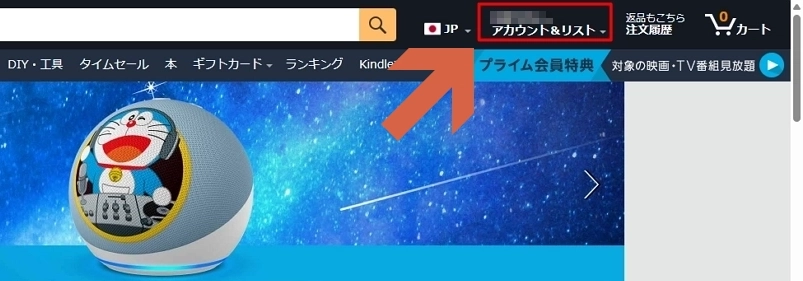
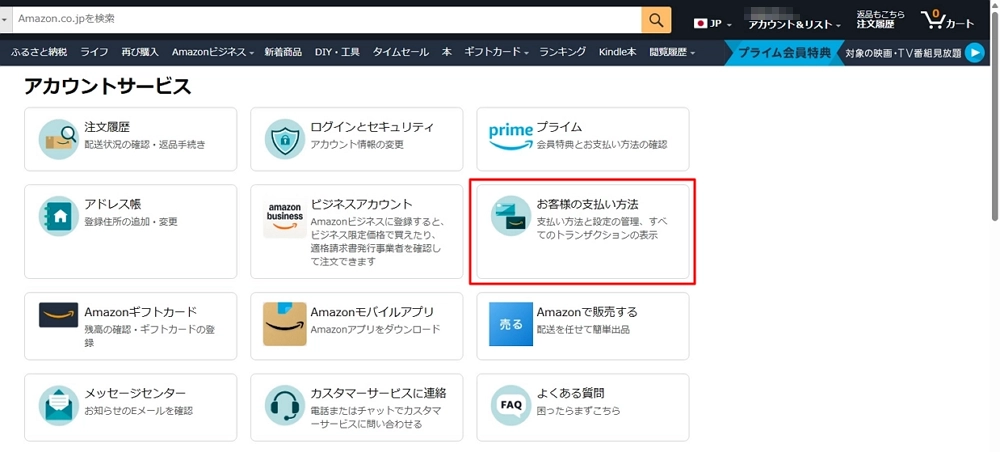
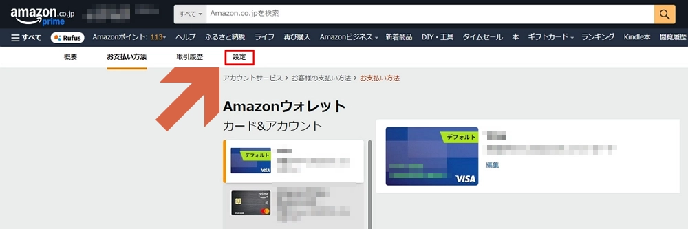
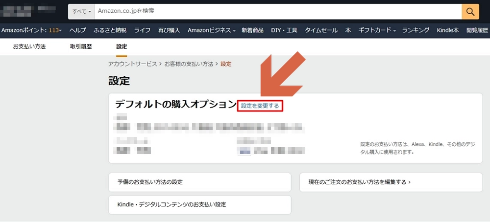
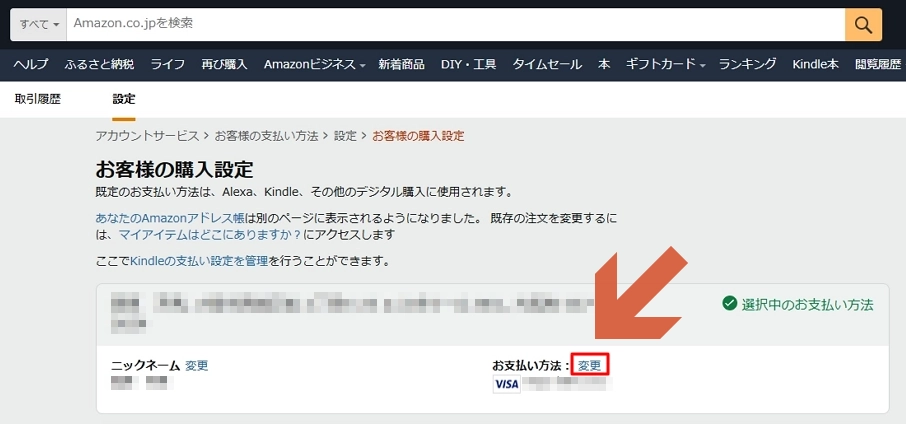
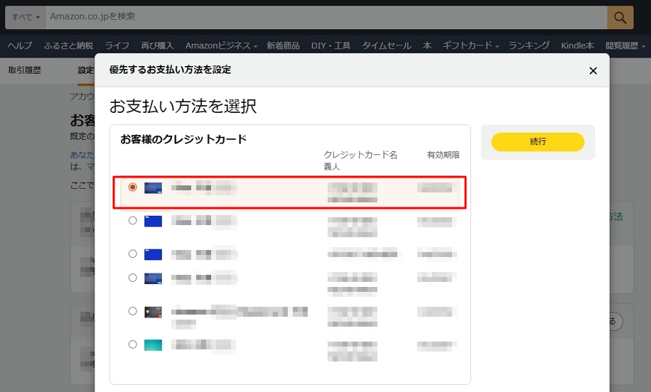

# デフォルトの支払方法を変更する方法

ウェブサイト経由で変更する方法は以下のとおり。

## 手順
1. 右上の**アカウント&リスト**をクリック。

    

1. **お客様の支払い方法**をクリック。

    

1. **設定**をクリック。

    

1. **設定を変更する**をクリック。

    

1. **変更**をクリック。

    

1. デフォルトに設定したい支払方法を選択。

    

