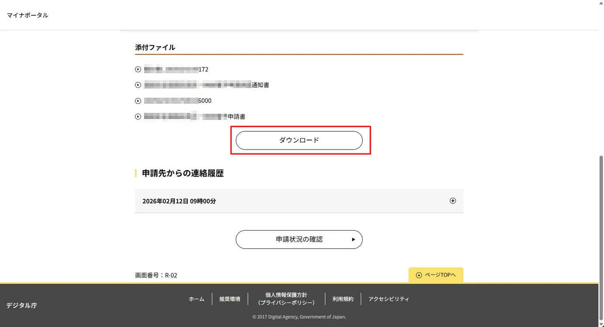
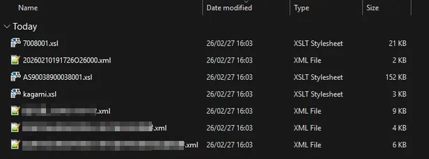
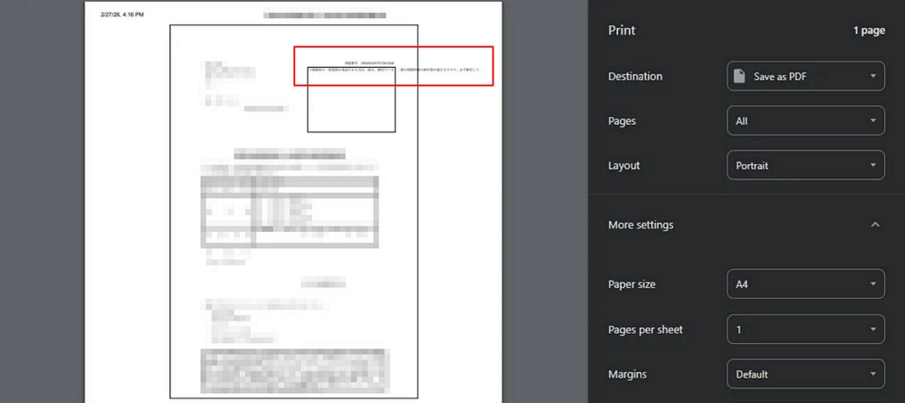
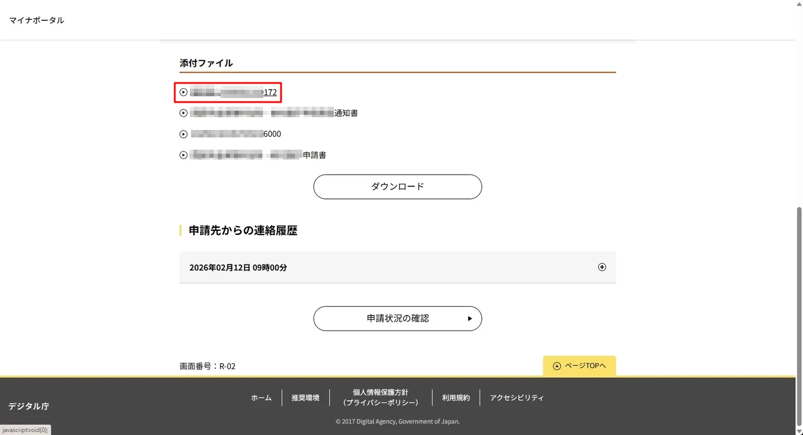
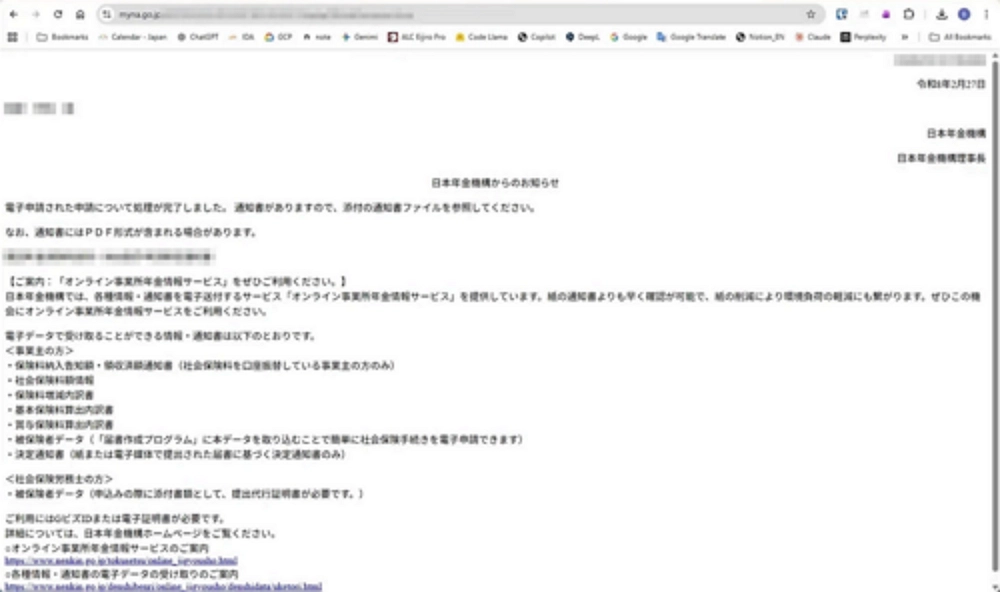
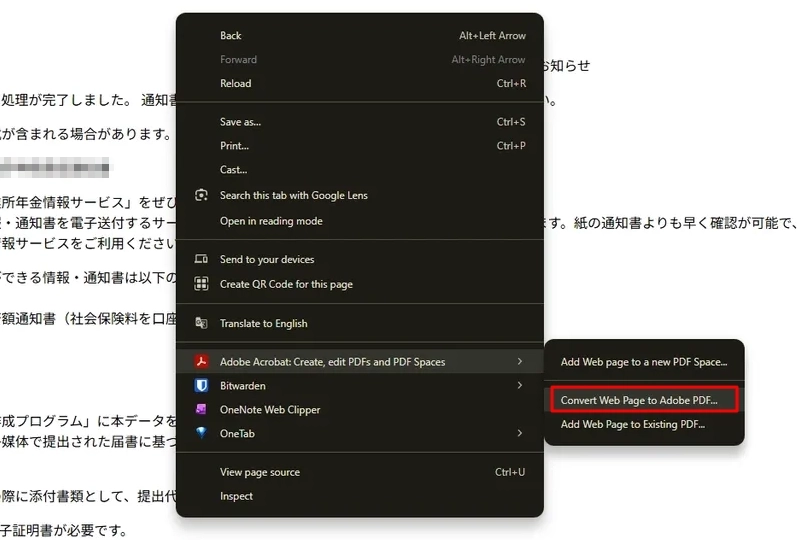

# 書類をダウンロードする方法

## まとめ

主なポイントは以下のとおり。

* 画面には**ダウンロード**ボタンが表示されるけど、このボタンはクリックしない。 
     
    **ダウンロード**ボタンをクリックすると、XMLファイルがダウンロードされる。 
    
* 書類を**プリント**からPDF保存しようとすると、テキストが枠からはみ出す。
    
* 上記の理由から、書類を正しくダウンロードするには、Acrobat Proが必要。

---

## 手順

1. マイナポータルにログイン。

1. 書類を一つずつクリック。

    

1. 書類がブラウザー上で表示される。

    

1. 右クリックから**Convert Web Page to Adobe PDF**を選択してPDFファイルをダウンロード。

    
