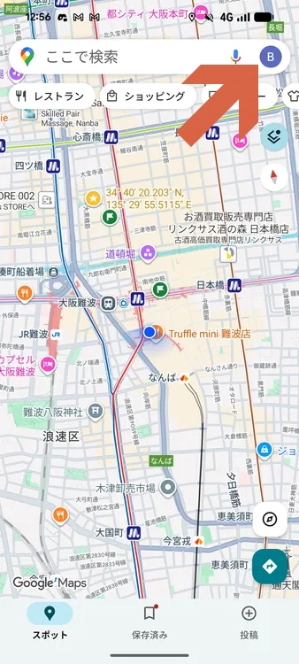
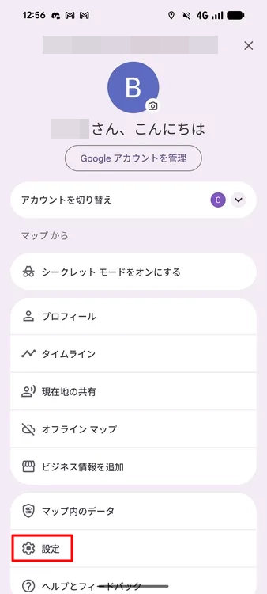
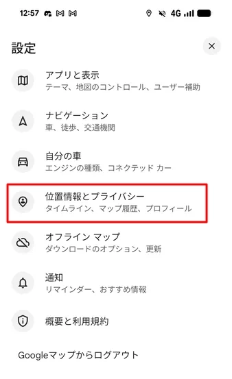
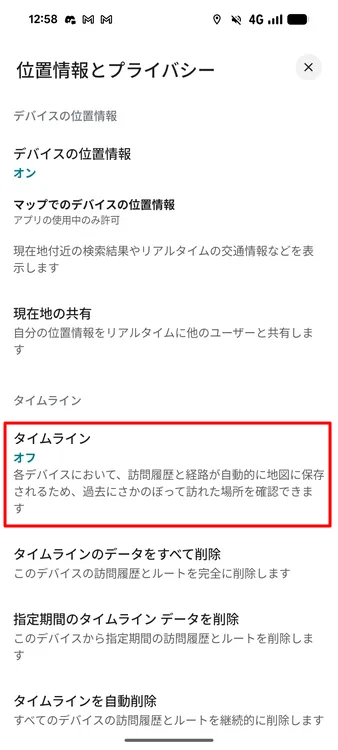
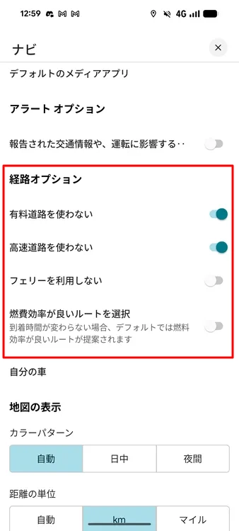
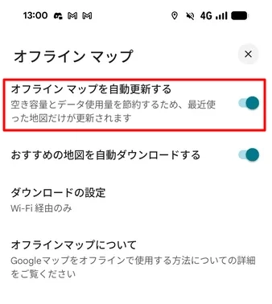

# 町ブラする場合の設定

1. アカウントアイコンをタップ。

    

1. **設定**をタップ。

    

1. **位置情報とプライバシー**をタップ。

    

1. 履歴を残す必要がない場合、**タイムライン**をオフ。

    

1. 車を使わない場合、**有料道路を使わない**や**高速道路を使わない**をオン。

    

1. 事前にオフラインマップをダウンロードして、自動更新をオン。

    